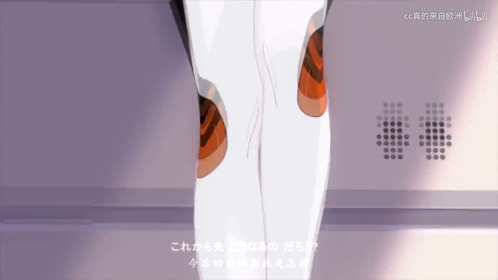

# 🎬 视频区

🧠 深度学习区

  <a class="video-card" id="attention-efficient" href="https://www.youtube.com/watch?v=Y-o545eYjXM" target="_blank" rel="noopener">
    

      
      
<svg viewBox="0 0 80 80" fill="none"><circle cx="40" cy="40" r="40" fill="rgba(0,0,0,0.5)"/><polygon points="32,24 60,40 32,56" fill="white"/></svg>

      YouTube
    

    

      
How Attention Got So Efficient [GQA/MLA/DSA]

    

  </a>

  <a class="video-card" id="diffusion-policy-intro" href="https://www.youtube.com/watch?v=e4VTrXqo1-Q" target="_blank" rel="noopener">
    

      
      
<svg viewBox="0 0 80 80" fill="none"><circle cx="40" cy="40" r="40" fill="rgba(0,0,0,0.5)"/><polygon points="32,24 60,40 32,56" fill="white"/></svg>

      YouTube
    

    

      
上交IWIN实验室：最适合入门的diffusion policy

    

  </a>

  <a class="video-card" id="diffusion-models-scratch" href="https://www.youtube.com/watch?v=B4oHJpEJBAA" target="_blank" rel="noopener">
    

      
      
<svg viewBox="0 0 80 80" fill="none"><circle cx="40" cy="40" r="40" fill="rgba(0,0,0,0.5)"/><polygon points="32,24 60,40 32,56" fill="white"/></svg>

      YouTube
    

    

      
Diffusion Models From Scratch | Score-Based Generative Models Explained

    

  </a>

🌿 日常区

  <a class="video-card" id="jin-tangli" href="https://www.bilibili.com/video/BV1Lb9GB8ELk/" target="_blank" rel="noopener">
    

      
      
<svg viewBox="0 0 80 80" fill="none"><circle cx="40" cy="40" r="40" fill="rgba(0,0,0,0.5)"/><polygon points="32,24 60,40 32,56" fill="white"/></svg>

      bilibili
    

    

      
如何做一杯好喝的金汤力

    

  </a>

📦 其他区 （测试）

  <a class="video-card" id="honkai3-mad" href="assets/崩坏3两周年MAD-月光的指引.mp4" target="_blank" rel="noopener">
    

      
      
<svg viewBox="0 0 80 80" fill="none"><circle cx="40" cy="40" r="40" fill="rgba(0,0,0,0.5)"/><polygon points="32,24 60,40 32,56" fill="white"/></svg>

      本地收藏
    

    

      
【崩坏3两周年MAD】月光的指引 ツキアカリのミチシルベ

    

  </a>

