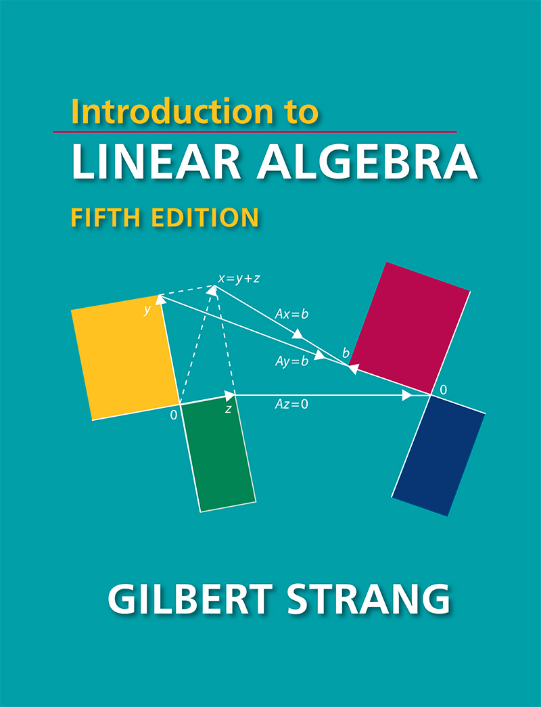
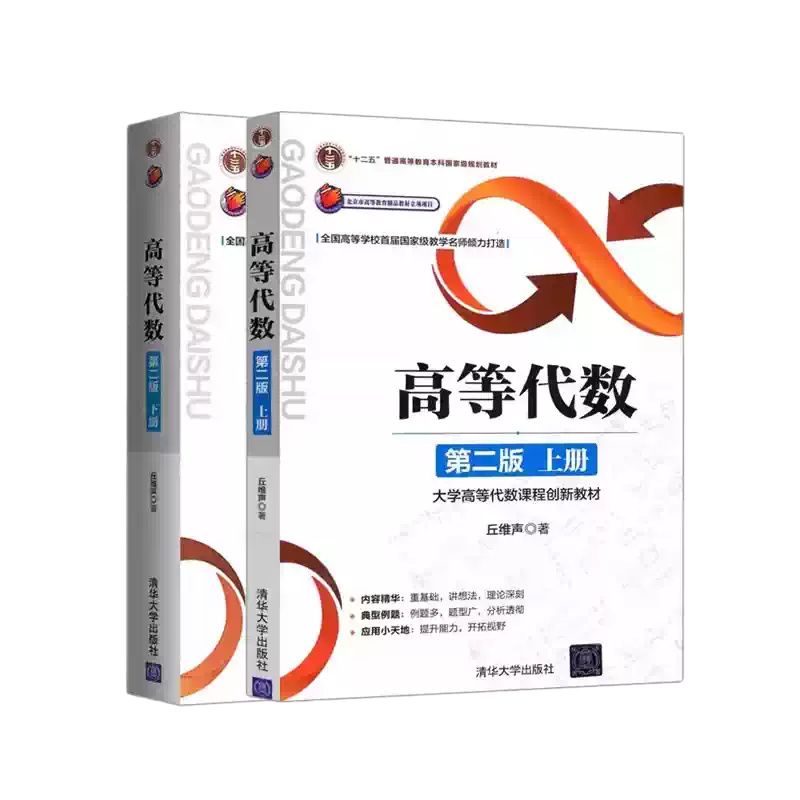

# MIT18.06: Linear Algebra/丘维声高等代数

# MIT18.06: Linear Algebra

## 课程简介

- 所属大学：MIT
- 先修要求：英文
- 编程语言：无
- 课程难度：🌟🌟🌟
- 预计学时：因人而异

数学大牛 Gilbert Strang 老先生年逾古稀仍坚持授课，其经典教材 [Introduction to Linear Algebra](https://math.mit.edu/~gs/linearalgebra/) 已被清华采用为官方教材。我当时看完盗版 PDF 之后深感愧疚，含泪花了两百多买了一本英文正版收藏。下面附上此书封面，如果你能完全理解封面图的数学含义，那你对线性代数的理解一定会达到新的高度。

配合油管数学网红 **3Blue1Brown** 的[线性代数的本质](https://www.youtube.com/playlist?list=PLZHQObOWTQDPD3MizzM2xVFitgF8hE_ab)系列视频食用更佳。

## 课程资源

- 课程网站：[fall2011](https://ocw.mit.edu/courses/mathematics/18-06sc-linear-algebra-fall-2011/syllabus/)
- 课程视频：参见课程网站
- 课程教材：Introduction to Linear Algebra. Gilbert Strang
- 课程作业：参见课程网站

2023年5月15日，Gilbert Strang 上完了他在 18.06 的[最后一课](https://ocw.mit.edu/courses/18-06sc-linear-algebra-fall-2011/pages/final-1806-lecture-2023/)，以88岁高龄结束了在其 MIT 61年的教学及科研生涯。但他的线性代数课已经并且还将继续影响一代代青年学子，让我们向老先生致以最崇高的敬意。

# 丘维声：高等代数

## 课程简介

- 所属大学：北京大学
- 先修要求：无
- 编程语言：无
- 课程难度：🌟🌟🌟
- 预计学时：因人而异

高等代数一般是国内数学系科班上的课程，用来取代非科班的线性代数，因此难度会大很多。当然，内容也会更丰富，整体侧重证明，告诉你为什么这样是行得通的，并且对线性空间也有进一步讲解，适合想冲难度的同学食用。其中，国内北京大学大牛丘维声领衔的这门课由于质量高，加上教科书质量也高，因此可以说是入门首选。

## 课程资源

- 课程网站：b站可以搜到
- 课程视频：参见课程网站
- 课程教材：高等代数丘维声白皮版本
- 课程作业：参见课程网站
