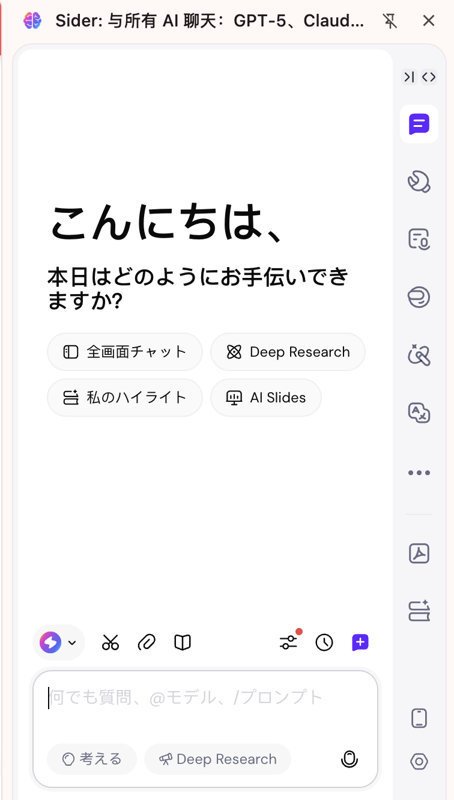
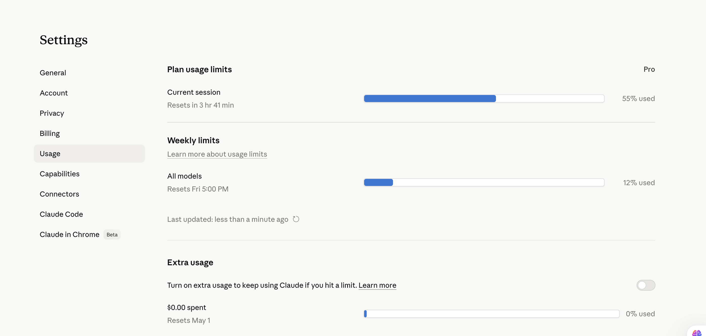

# AI 工具推荐

> AI真的太好用了你知道吗！

---

在写下这篇文章的时候，AI早已无处不在，包括本专栏的建立也很大依赖于AI的帮助。因此在此处整理几个我认为很好用的AI工具，以供参考

## 常用工具

### Sider

sider是一款AI聚合软件，且它可以以浏览器插件的形式存在，提供几乎所有市面上主流AI的查询功能。并且由于与浏览器高度融合，因此可以实现划线翻译、网页OCR等功能，十分方便。可惜目前暂时不开放API。

{ style="zoom:25%;" }

### Gemini、chatGPT、DeepSeek等

这些直接到对应官方平台购买的会员放在这里一并讲。他们的特点是只能用对应自家的模型，收费贵（一般20$/月），但是几乎可以无限使用高级查询功能（相比之下Sider大概只能一个月100次）。并且提供API选项，可以方便接入第三方软件。另外值得提醒的是，这些软件对学生邮箱有优惠，比如Gemini Pro使用学生邮箱打开就是免费的。


### Claude Code

今年编程界的一大神器，我认为比目前的龙虾🦞都要好用，配置简单功能强大，而且写出来的程序可用性都非常高。本专栏的摸鱼游戏都是用它写出来的。价格目前有点高，Pro版22美元一个月，Max版110美元一个月，就当买个玩具了。

{ style="zoom:25%;" }

安装也极度简单，在 Mac 上安装 Anthropic 的 **Claude Code**（官方 CLI 工具）非常简单。官方强烈建议使用**原生安装脚本**，因为它自带自动更新功能，不需要依赖 Node.js 或 npm。

以下是具体的安装方法与步骤：

##### 1. 原生安装（官方推荐）

这是最简单、最不易出错的方法。

1. 打开 Mac 的**终端 (Terminal)**。

2. 复制并粘贴以下命令，然后按回车运行：

   Bash

   ```
   curl -fsSL https://claude.ai/install.sh | bash
   ```

3. 脚本会自动下载二进制文件、配置 PATH 环境变量并设置后台自动更新（整个过程通常不到 1 分钟）。

------

##### 2. 其他安装选项

如果你有特定的包管理习惯，也可以选择以下方式，但这两种方式**不支持后台自动更新**，需要你日后手动更新。

- ###### **使用 Homebrew：**

  如果你是 Homebrew 用户，可以直接通过 cask 安装：

  Bash

  ```
  brew install --cask claude-code
  ```

  *(日后更新需运行 `brew upgrade claude-code`)*

- ###### **使用 npm（适合需固定版本的开发者）：**

  要求系统已安装 Node.js 18 或以上版本。

  Bash

  ```
  npm install -g @anthropic-ai/claude-code
  ```

  *(注意：尽量避免使用 `sudo npm install`，以免引发权限错误)*

------

##### 安装后的初始化步骤

安装完成后，你需要进行账号授权才能开始使用：

1. **验证安装：** 运行以下命令，如果有输出版本号则说明安装成功。

   Bash

   ```
   claude --version
   ```

2. **登录与授权：** 在终端中输入启动命令。

   Bash

   ```
   claude
   ```

   如果是首次运行，Claude Code 会自动唤起默认浏览器，提示你登录并授权 Anthropic 账号。

3. **环境诊断（可选）：** 你可以随时运行 `claude doctor` 来诊断本地环境配置、网络或权限是否存在隐患。

> **💡 重要注意事项：**
>
> - **系统要求：** 需要运行 macOS 13.0 或更高版本。
> - **付费门槛：** 使用 Claude Code 需要拥有 **Claude Pro 订阅**、**Team 订阅** 或拥有 Anthropic Console 开发者账号并绑定计费。免费版账号目前无法使用该工具。
