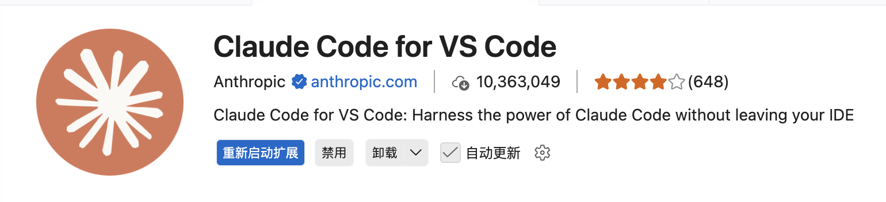
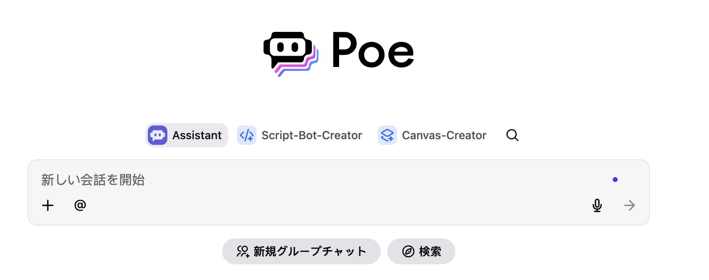

# AI 工具推荐

> AI真的太好用了你知道吗！

---

You can first install the AI tools mentioned below, then use them to translate the content of this website; that way the translations will most closely match the original meaning.

まず以下に挙げるAIツールをインストールし、それらを使って本サイトの内容を翻訳してください。そうすることで、原文の意味に最も近い翻訳が得られます。


在写下这篇文章的时候，AI早已无处不在，包括本专栏的建立也很大依赖于AI的帮助。因此在此处整理几个我认为很好用的AI工具，以供参考


## 常用工具

### Sider

sider是一款AI聚合软件，且它可以以浏览器插件的形式存在，提供几乎所有市面上主流AI的查询功能。并且由于与浏览器高度融合，因此可以实现网页划线翻译、网页OCR等功能，十分方便。可惜目前暂时不开放API。

免费版每天20次基础查询，Basic版大概有3000次基础查询，200次高级查询，升级到了Plus版则可以有无限查询额度。

{ style="zoom:50%;" }

### Gemini、chatGPT、DeepSeek等

这些直接到对应官方平台购买的会员放在这里一并讲。他们的特点是只能用对应自家的模型，收费贵（一般20$/月），但是几乎可以无限使用高级查询功能（相比之下Sider大概只能一个月100次）。并且提供API选项，可以方便接入第三方软件。另外值得提醒的是，这些软件对学生邮箱有优惠，比如Gemini Pro使用学生邮箱打开就是免费的。


### Claude Code

今年编程界的一大神器，我认为比目前的龙虾🦞都要好用，配置简单功能强大，而且写出来的程序可用性都非常高。本专栏的摸鱼游戏都是用它写出来的。价格目前有点高，Pro版22美元一个月，Max版110美元一个月，就当买个玩具了。一般来说，Pro额度大概能让你一天耍上两三次AI coding。

{ style="zoom:25%;" }

安装也极度简单，在 Mac 上安装 Anthropic 的 **Claude Code**（官方 CLI 工具）非常简单。官方强烈建议使用**原生安装脚本**，因为它自带自动更新功能，不需要依赖 Node.js 或 npm。

以下是具体的安装方法与步骤：

##### 1. 原生安装（官方推荐）

这是最简单、最不易出错的方法。

1. 打开 Mac 的**终端 (Terminal)**。

2. 复制并粘贴以下命令，然后按回车运行：

   Bash

   ```
   curl -fsSL https://claude.ai/install.sh | bash
   ```

3. 脚本会自动下载二进制文件、配置 PATH 环境变量并设置后台自动更新（整个过程通常不到 1 分钟）。

接下来会需要加入PATH路径之类的操作，简单解决一下就行。

另外，VScode或其他同类型软件也提供对应的插件，能让你在编辑器内使用Claude Code，在插件区搜索

{ style="zoom:50%;" }

下载即可。


### Poe 网页AI聚合平台

Poe是一款相对老牌的AI聚合平台，你几乎可以在这里用到市面上所有牌子的AI，保证最大广度的尝新体验。包括但不限于文本、图片、视频、助理等类型。缺点是单价相对贵一点。


