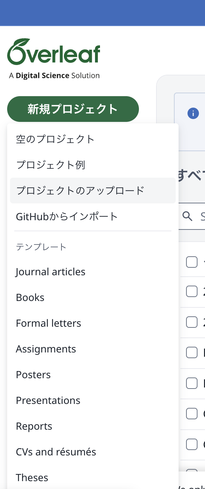
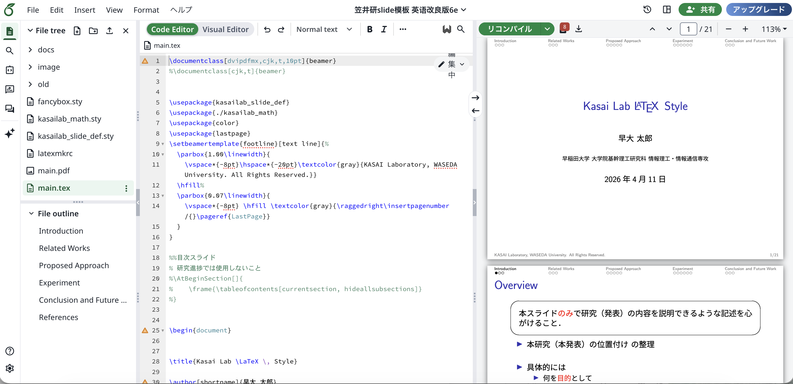

# LaTeX安装与使用教程

$\LaTeX$是一款常用于科研与教育的文本语言，因为它支持强大且严格的文本格式以及数学、科学公式编写。我们研究室使用的ppt（日本叫slide）模版也是由LaTeX的beam模版改写而来。

相比所见即所得的word，LaTeX是所想即所得的，因此使用起来相比word会稍难一点。下面的教程会先教你如何打开和编译tex文件，然后简要地讲解最核心的latex语句教程。更详细的教程，以现在AI的实力，相信能解决你遇到的其它大部分问题，你永远可以相信AI（而且作为一个深度学习实验室，学会如何用AI是基本功了！）

## 什么是TeX？TeX历史简单介绍

在撰写学术论文时，我们常常需要面对复杂的排版和海量的数学公式。为了优雅地解决这个问题，**TeX** 应运而生。

**TeX的发明与演变**

TeX 是由著名计算机科学家、图灵奖得主高德纳（Donald Knuth）在20世纪70年代末发明的排版系统。


当时，高德纳在校对他的巨著《计算机程序设计艺术》（*The Art of Computer Programming*)时，对出版社糟糕的排版质量感到极为失望，尤其是数学公式的排版。于是，他决定自己动手，开发一套能够生成高质量印刷品的排版语言，这就是 TeX。

然而，原生的 TeX 语法非常底层且复杂，普通用户学习成本极高。到了20世纪80年代，计算机科学家莱斯利·兰伯特（Leslie Lamport）在 TeX 的基础上开发了一套宏包集合，这就是我们现在熟知的 **LaTeX**。LaTeX 极大地简化了 TeX 的使用，让作者可以将主要精力集中在文章的**内容**上，而不是排版的**细节**上。

**LaTeX 的核心功能与优势**

今天，LaTeX 已经成为理工科领域的学术排版标准。它支持极其强大的功能：

- **无与伦比的数学公式排版**：无论是简单的微积分还是复杂的矩阵，LaTeX 都能渲染得非常漂亮。
- **自动化管理**：自动生成目录、交叉引用以及参考文献。
- **分离内容与格式**：通过更换模板（Class），你可以一键将文章从“会议格式”切换为“期刊格式”，无需重新调整字体和段落。


## 使用Overleaf进行编译

对于刚接触 LaTeX 的新人来说，配置本地环境可能会遇到各种报错。**Overleaf** 是一个在线的、基于云端的 LaTeX 编辑器，它能让你像使用 Google Docs 或腾讯文档一样，打开浏览器就能写论文。

**1. 注册与登录**

访问 Overleaf 官网，你可以使用邮箱或关联相关学术账号直接注册登录。无需安装任何软件。


**2. 创建你的第一个项目**

登录后，点击左上角的“New Project”（新建项目）。你可以选择创建一个“Blank Project”（空白项目），也可以直接从海量的“Templates”（模板）中寻找适合的学术期刊或会议模板。由于研究室已经有对应模板，因此我们选择上传文档。



**3. 认识操作界面**

打开项目后，你会看到一个经典的三栏/两栏布局：

- **左侧文件树**：用于管理你的 `.tex` 源码文件、插入的图片文件以及参考文献的 `.bib` 文件。
- **中间编辑区**：这里是你编写 LaTeX 代码的地方。
- **右侧预览区**：这里显示编译后生成的 PDF 文件。
- 


**修改 Overleaf 编译器设置：**

- 点击 Overleaf 编辑界面左上角的 **Menu**（菜单）。
- 找到 **Settings** -> **Compiler**（编译器）。
- 将默认的 `pdfLaTeX` 改为 **`LaTeX`**。
- *注意：千万不要选 XeLaTeX 或 LuaLaTeX，就选最基础的 `LaTeX`，这样 Overleaf 就会乖乖去读取你的 `latexmkrc` 配置文件，并使用 `pLaTeX` 和 `dvipdfmx` 来生成 PDF 了。*


**4. 编译与下载**

在你修改了代码后，只需按下快捷键 `Ctrl + S`（或 `Cmd + S`），或者点击预览区上方绿色的“Recompile”按钮，Overleaf 就会自动编译并更新右侧的 PDF。完成写作后，点击右上角的下载按钮即可获取最终的 PDF 文件。


## 研究室模板的结构与编辑

研究室原版模板由教授在2020年左右从beam学术模版改造而来，以下称为第一版，这款主题奠定了研究室seminar的学术报告风格。按照教授的要求，所有研究室内使用的slide都要用它来编译。

然而这款模板有许多小问题，引擎太老、只支持日文，所以2024年左右研究室的学长们给它加上描述文件和其它部件，保证它在大多数编译环境内都能成功编译，并且支持全文件英文内容，这是第二版。

目前新生使用的是第三版，第三版由本人于2025年初，根据计算机专业的标准论文格式重构而来，改写了main.tex的结构，将各章节拆分到doc文件夹中，大幅简化了代码与逻辑，并基本消除了由语言差异带来的报错，正式支持中日英韩与常用科学符号。删掉了已经过时或无用的文件，简化包体。尽管原本想重写整个项目🤔，但是太屎山代码了，哪怕后来有AI也很难搞，所以目前暂时先只能这样了。


下面介绍文件主要结构。main.tex是整个文档的入口，在此可以编辑标题页和各章节的标题。而main的最下方

```latex
\section{References}
%\input{docs/references}

%\section{Appendix and Tips}
%\input{docs/tips}
```

均未启用。这是因为某些引擎对文献支持有差异，可能会有报错，所以干脆先注释掉，如果想要启用把前面百分号去掉就行。另一个原因是Overleaf于2025年底更新了使用政策，导致免费编译时间从15秒下降到12秒，恰好导致文档不够时间编译完，所以只好把最后一页也注释掉以保证各平台兼容性了。如果不是在免费版Overleaf使用，大家可以随时开启下面的两页。

另外该模板有一些黄色警告和少量报错是正常的，不用管它，这是因为日文渲染引擎的屎山代码造成的，只要不是严重报错都可以不用管它。

doc文件夹存放的是各章节实际内容，image文件夹存放的是slide用到的图片。平时书写latex最好按照一定的规范进行操作，这样能大幅减少工作流的错误。


## 使用VS Code进行本地LaTeX编译

虽然 Overleaf 很方便，但当你的论文项目变得庞大，或者网络环境不稳定时，**本地编译**是更专业、更高效的选择。Visual Studio Code (VS Code) 是目前最流行的代码编辑器，通过配置，它可以成为一个完美的 LaTeX 写作环境。

要实现本地编译，我们需要两样东西：**编译器（引擎）\**和\**编辑器（VS Code）**。

### Windows 系统配置教程

1. **安装编译器 (TeX Live)**：
   - 前往清华大学开源软件镜像站或其他镜像，下载 TeX Live 的 `.iso` 镜像文件。
   - 右键装载镜像，右键以管理员身份运行 `install-tl-windows.bat`。
   - 按照默认设置一路安装（过程可能需要几十分钟到一小时，请耐心等待）。
2. **安装并配置 VS Code**：
   - 下载并安装 VS Code。
   - 在 VS Code 左侧的扩展（Extensions）商店中，搜索并安装名为 **LaTeX Workshop** 的插件。如果是初次使用Vscode，建议再搜索一个chinese文本包，这样Vscode就是中文的了。
   - 安装完成后，VS Code 就能自动识别 `.tex` 文件，并调用底层的 TeX Live 进行编译了。

### macOS 系统配置教程

1. **安装编译器 (MacTeX)**：
   - 前往 MacTeX 官网，下载完整版的 `MacTeX.pkg` 安装包。
   - 双击安装包，按照提示完成安装（体积较大，推荐在网络良好的环境下下载）。
2. **安装并配置 VS Code**：
   - 下载并安装针对 macOS 的 VS Code。
   - 同样地，在扩展商店中搜索并安装 **LaTeX Workshop** 插件。
   - （进阶）如果遇到编译中文的问题，可以在 VS Code 的 `settings.json` 中将默认的编译链配置为 `xelatex`。


Overleaf 最省心的一点是它会自动检测需要编译几次、是否需要编译参考文献。在本地，我们可以通过配置 `latexmk` 工具来实现完全一样的效果。

在 VS Code 中按下 `Ctrl + Shift + P`（Mac 为 `Cmd + Shift + P`），输入 `Open Settings (JSON)`，打开 `settings.json` 文件，将以下配置合并到你的 JSON 文件中，如果你之前没有太多自定义设置（或者原来的设置不重要），最不容易出错的方法是**全选覆盖**。

请把 `settings.json` 里面的内容**全部清空（Ctrl+A全选，然后删除）**，然后把下面这一整段（包含最外层的大括号）完完整整地粘贴进去：：

```json
{
    "latex-workshop.latex.tools": [
        {
            "name": "latexmk (xelatex)",
            "command": "latexmk",
            "args": [
                "-synctex=1",
                "-interaction=nonstopmode",
                "-file-line-error",
                "-pdfxe",
                "-outdir=%OUTDIR%",
                "%DOC%"
            ]
        },
        {
            "name": "latexmk (pdflatex)",
            "command": "latexmk",
            "args": [
                "-synctex=1",
                "-interaction=nonstopmode",
                "-file-line-error",
                "-pdf",
                "-outdir=%OUTDIR%",
                "%DOC%"
            ]
        }
    ],
    "latex-workshop.latex.recipes": [
        {
            "name": "XeLaTeX (推荐, 完美支持中文)",
            "tools": [
                "latexmk (xelatex)"
            ]
        },
        {
            "name": "pdfLaTeX (英文论文常用)",
            "tools": [
                "latexmk (pdflatex)"
            ]
        }
    ],
    "latex-workshop.latex.autoBuild.run": "onFileChange",
    "latex-workshop.view.pdf.viewer": "tab"
}
```

1. 粘贴完之后，按下 **`Ctrl + S`** 确保 `settings.json` 文件已保存（文件标签页上的白色小圆点消失）。
2. 为了保险起见，**把 VS Code 关掉，重新打开**。
3. 再次回到你的 `test.tex` 文件中，随便敲个空格，按 `Ctrl + S` 触发编译。

只要这份配置被成功读取，插件左下角就会显示默认的 `Recipe: XeLaTeX`，而且就能正常编译出 PDF 了！再试一次看看。


如果还是不行，那可能是因为这个模板太祖传了，基于你之前配置的 VS Code 环境（我们用的是 `XeLaTeX`），如果直接编译这份文件，**100% 会报错或者排版错乱**。以下是你必然会遇到的三个核心问题，按严重程度排序：

##### 1. 致命冲突：编译引擎与驱动不匹配 (`dvipdfmx` 冲突)

- **引发报错的代码：** `\documentclass[dvipdfmx,cjk,t,10pt]{beamer}`
- **为什么会报错：** * `[dvipdfmx]` 和 `[cjk]` 这两个选项，是专门为日本传统的 `pLaTeX` 或 `upLaTeX` 编译引擎准备的（流程是：代码 -> DVI 文件 -> PDF）。
  - 而你目前 VS Code 里配置并默认使用的是**现代的 `XeLaTeX` 引擎**（流程是：代码直接生成 PDF）。`XeLaTeX` 不认识也不需要 `dvipdfmx`。如果强行用 `XeLaTeX` 编译，轻则弹出大量 Warning 并导致图片和颜色无法显示，重则直接编译中断。

##### 2. 找不到自定义宏包文件 (File Not Found)

- **引发报错的代码：** * `\usepackage{kasailab_slide_def}`
  - `\usepackage{./kasailab_math}`
- **为什么会报错：** * 这里的 `.sty` 文件是你们实验室学长学姐自己写的自定义样式表。如果你的项目文件夹（`main.tex` 所在的目录）里没有 `kasailab_slide_def.sty` 和 `kasailab_math.sty` 这两个文件，编译器会直接报 `File not found` 错误并停止运行。

##### 3. 找不到章节源文件 (File Not Found)

- **引发报错的代码：** * `\input{docs/chap1}` 到 `\input{docs/tips}`
- **为什么会报错：**
  - `\input` 命令会去读取外部文件。你需要确保你的根目录下有一个名为 `docs` 的文件夹，并且里面确确实实有 `chap1.tex`, `chap2.tex` 等文件。如果缺少任何一个，都会报错。

### 改 VS Code 配置以适配该文件

我们之前在 VS Code 里配置的是强制使用 `XeLaTeX`（参数里带有 `-pdfxe`），这会和实验室的配置“打架”。

请再次打开你的 `settings.json`（`Ctrl + Shift + P` -> `Open User Settings (JSON)`），将里面的 `tools` 和 `recipes` 替换为以下内容：

```json
{
    // ... 前面的其他设置保持不变 ...

    "latex-workshop.latex.tools": [
        {
            "name": "强制使用 pLaTeX (实验室模板专用)",
            "command": "latexmk",
            "args": [
                "-synctex=1",
                "-interaction=nonstopmode",
                "-file-line-error",
                "-pdfdvi",             // 强制走 DVI 转 PDF 模式
                "-latex=platex",       // 强制锁定底层引擎为 platex
                "-outdir=%OUTDIR%",
                "%DOC%"
            ]
        }
    ],
    "latex-workshop.latex.recipes": [
        {
            "name": "编译 Kasai Lab 模板",
            "tools": [
                "强制使用 pLaTeX (实验室模板专用)"
            ]
        }
    ],
    "latex-workshop.latex.autoBuild.run": "onFileChange",
    "latex-workshop.view.pdf.viewer": "tab"
}
```

### 接下来怎么做：

1. 检查并删掉魔法注释（如果有的话）。
2. 保存更新后的 `settings.json`。
3. 回到 `main.tex`，为了防止残留的错误文件干扰，按下 `Ctrl + Shift + P` (Mac 是 `Cmd + Shift + P`)，输入 **`LaTeX Workshop: Clean up auxiliary files`** 清理一下。
4. 再次按 `Ctrl + S` 保存编译。


## 10分钟学会LaTeX语法：一个极简的LaTeX教程

LaTeX 的本质是用文本指令来描述排版。一个基本的 LaTeX 文档分为**导言区**（Preamble）和**正文区**（Body）。

### 1. 文档的基本框架

极简来说，\begin{document}之前的内容是规定文档的全局格式，比如\documentclass{article}是指文章采用article格式，\usepackage{amsmath}是指加载美国数学协会的数学宏包，保证后面的主流数学公式能成功编译。

而\begin{document}到\end{document}之间的内容就是文章正文了，里面书写的内容是你能实际看到的内容。

```
% 这里是导言区：用于设置文档类型、调用宏包
\documentclass{article}
\usepackage{amsmath} % 引入数学宏包

% 这里是正文区：文章的所有内容都写在这里面
\begin{document}

\title{我的第一篇研究报告}
\author{张三}
\date{\today}
\maketitle % 这一行命令用来生成标题、作者和日期

你好，世界！这是我在研究室的第一篇 LaTeX 文档。

\end{document}
```

### 2. 章节与段落

在正文区中，你可以通过以下命令快速划分章节：

```
\section{引言}
这是引言的内容。另起一段时，在代码中只需空一行即可。

\subsection{研究背景}
这是引言下的一个小节。

\subsubsection{具体问题}
这是更小的一级标题。
```

### 3. 数学公式（核心重点）

LaTeX 最强大的地方在于数学公式排版。公式分为**行内公式**（嵌在文字中间）和**行间公式**（单独占一行）。

- **行内公式**：使用单个美元符号包裹。例如代码 `$E=mc^2$`，会渲染为：$E=mc^2$。
- **行间公式**：使用双美元符号包裹。例如以下代码：

```
$$f(x) = \int_{-\infty}^{\infty} \hat{f}(\xi)\,e^{2 \pi i \xi x} \,d\xi$$
```

将会渲染出非常专业的积分公式：

$$f(x) = \int_{-\infty}^{\infty} \hat{f}(\xi)\,e^{2 \pi i \xi x} \,d\xi$$

### 4. 环境

环境你可以理解为编程语言里的一些常用功能函数，begin后跟随的内容是指定哪种环境。通过不同的环境，实现对一些常用场景的高校排版。现实中常用的环境有align多行公式环境、各类matrix矩阵环境等

```
% 无序列表
\begin{itemize}
    \item 查阅文献
    \item 设计实验
    \item 收集数据
\end{itemize}

% 有序列表
\begin{enumerate}
    \item 第一步
    \item 第二步
\end{enumerate}
```


### 5.常用数学符号

这里我省事一点，直接让Gemini给我生成一个了：

这是一份为您整理的常用 LaTeX 数学符号、环境以及公式书写方法的速查指南。排版已经过优化，非常适合作为教学讲义或参考资料使用。

#### 一、 基础公式书写环境

在 LaTeX 或 Markdown 中，数学公式主要分为**行内公式**和**独立公式（行间公式）**。

| **环境类型** | **说明**                             | **代码示例**                                  | **渲染效果**             |
| ------------ | ------------------------------------ | --------------------------------------------- | ------------------------ |
| **行内公式** | 嵌在段落文字中                       | `文字 $E=mc^2$ 文字`                          | 文字 $E=mc^2$ 文字       |
| **独立公式** | 单独占一行，居中显示                 | `$$E=mc^2$$`                                  | $$E=mc^2$$               |
| **编号公式** | 独立成行并自动编号（多用于纯 LaTeX） | `\begin{equation} a^2+b^2=c^2 \end{equation}` | (渲染同独立公式并带编号) |

------

#### 二、 基本数学结构

掌握上下标、分数和根号是书写大部分公式的基础。

| **说明**       | **LaTeX 代码** | **渲染效果**  | **注意事项**                                     |
| -------------- | -------------- | ------------- | ------------------------------------------------ |
| **上标**       | `a^2`          | $a^2$         | 若上标多于一个字符，需用大括号包裹，如 `a^{x+1}` |
| **下标**       | `a_i`          | $a_i$         | 同上，如 `a_{i,j}`                               |
| **上下标组合** | `x_i^2`        | $x_i^2$       | 顺序无关紧要                                     |
| **分数**       | `\frac{a}{b}`  | $\frac{a}{b}$ | `\frac{分子}{分母}`                              |
| **平方根**     | `\sqrt{x}`     | $\sqrt{x}$    |                                                  |
| **n次方根**    | `\sqrt[n]{x}`  | $\sqrt[n]{x}$ | 方括号内为开方数                                 |

------

#### 三、 常用数学符号

##### 1. 希腊字母 (Greek Letters)

*注：大写希腊字母只需将首字母大写即可（部分大写字母与拉丁字母相同，如 A, B，直接打出即可）。*

| **小写代码** | **效果**  |      | **大写代码** | **效果**  |      | **变体代码**  | **效果**      |
| ------------ | --------- | ---- | ------------ | --------- | ---- | ------------- | ------------- |
| `\alpha`     | $\alpha$  |      | `\Gamma`     | $\Gamma$  |      | `\varepsilon` | $\varepsilon$ |
| `\beta`      | $\beta$   |      | `\Delta`     | $\Delta$  |      | `\varphi`     | $\varphi$     |
| `\gamma`     | $\gamma$  |      | `\Theta`     | $\Theta$  |      | `\varrho`     | $\varrho$     |
| `\delta`     | $\delta$  |      | `\Lambda`    | $\Lambda$ |      |               |               |
| `\theta`     | $\theta$  |      | `\Xi`        | $\Xi$     |      |               |               |
| `\lambda`    | $\lambda$ |      | `\Pi`        | $\Pi$     |      |               |               |
| `\mu`        | $\mu$     |      | `\Sigma`     | $\Sigma$  |      |               |               |
| `\pi`        | $\pi$     |      | `\Phi`       | $\Phi$    |      |               |               |
| `\omega`     | $\omega$  |      | `\Omega`     | $\Omega$  |      |               |               |

##### 2. 运算符与关系符 (Operators & Relations)

| **说明**   | **LaTeX 代码** | **效果** |      | **说明**     | **LaTeX 代码**  | **效果**  |
| ---------- | -------------- | -------- | ---- | ------------ | --------------- | --------- |
| **乘号**   | `\times`       | $\times$ |      | **大于等于** | `\ge` 或 `\geq` | $\ge$     |
| **除号**   | `\div`         | $\div$   |      | **小于等于** | `\le` 或 `\leq` | $\le$     |
| **点乘**   | `\cdot`        | $\cdot$  |      | **不等于**   | `\neq`          | $\neq$    |
| **加减号** | `\pm`          | $\pm$    |      | **约等于**   | `\approx`       | $\approx$ |
| **减加号** | `\mp`          | $\mp$    |      | **等价于**   | `\equiv`        | $\equiv$  |
| **无穷大** | `\infty`       | $\infty$ |      | **正比于**   | `\propto`       | $\propto$ |

##### 3. 集合与逻辑符号 (Sets & Logic)

| **说明**   | **LaTeX 代码** | **效果**    |      | **说明**      | **LaTeX 代码** | **效果**     |
| ---------- | -------------- | ----------- | ---- | ------------- | -------------- | ------------ |
| **属于**   | `\in`          | $\in$       |      | **任意/全称** | `\forall`      | $\forall$    |
| **不属于** | `\notin`       | $\notin$    |      | **存在**      | `\exists`      | $\exists$    |
| **子集**   | `\subset`      | $\subset$   |      | **并集**      | `\cup`         | $\cup$       |
| **包含**   | `\subseteq`    | $\subseteq$ |      | **交集**      | `\cap`         | $\cap$       |
| **空集**   | `\emptyset`    | $\emptyset$ |      | **实数集**    | `\mathbb{R}`   | $\mathbb{R}$ |

------

#### 四、 微积分与大型运算符

这类符号通常会根据是“行内公式”还是“独立公式”自动调整大小。

| **说明**     | **LaTeX 代码**                  | **效果**                        |
| ------------ | ------------------------------- | ------------------------------- |
| **极限**     | `\lim_{x \to 0} f(x)`           | $\lim_{x \to 0} f(x)$           |
| **求和**     | `\sum_{i=1}^{n} x_i`            | $\sum_{i=1}^{n} x_i$            |
| **连乘**     | `\prod_{i=1}^{n} x_i`           | $\prod_{i=1}^{n} x_i$           |
| **不定积分** | `\int f(x) dx`                  | $\int f(x) dx$                  |
| **定积分**   | `\int_{a}^{b} f(x) dx`          | $\int_{a}^{b} f(x) dx$          |
| **多重积分** | `\iint`, `\iiint`               | $\iint$, $\iiint$               |
| **偏导数**   | `\frac{\partial f}{\partial x}` | $\frac{\partial f}{\partial x}$ |

------

#### 五、 矩阵与分段函数环境

对于复杂的多行结构，LaTeX 使用 `\begin{环境名} ... \end{环境名}` 来实现。

*注：在这些环境中，`&` 用于对齐，`\\` 用于换行。*

##### 1. 矩阵 (Matrices)

常见矩阵环境有三种：`matrix` (无括号)、`pmatrix` (小括号)、`bmatrix` (中括号)。

**LaTeX 代码：**

コード スニペット

```
$$
\begin{bmatrix}
  1 & 2 & 3 \\
  4 & 5 & 6 \\
  7 & 8 & 9
\end{bmatrix}
$$
```

**渲染效果：**

$$\begin{bmatrix}  1 & 2 & 3 \\  4 & 5 & 6 \\  7 & 8 & 9 \end{bmatrix}$$

##### 2. 分段函数 (Cases)

使用 `cases` 环境书写分段函数。

**LaTeX 代码：**

コード スニペット

```
$$
f(x) =
\begin{cases}
  x^2,  & x \ge 0 \\
  -x, & x < 0
\end{cases}
$$
```

**渲染效果：**

$$f(x) = \begin{cases}  x^2,  & x \ge 0 \\  -x, & x < 0 \end{cases}$$

##### 3. 多行公式对齐 (Align)

使用 `align` 或 `aligned` 环境，并在需要对齐的等号前加 `&`。

**LaTeX 代码：**

コード スニペット

```
$$
\begin{aligned}
  (a+b)^2 &= (a+b)(a+b) \\
          &= a^2 + ab + ba + b^2 \\
          &= a^2 + 2ab + b^2
\end{aligned}
$$
```

**渲染效果：**

$$\begin{aligned}  (a+b)^2 &= (a+b)(a+b) \\          &= a^2 + ab + ba + b^2 \\          &= a^2 + 2ab + b^2 \end{aligned}$$

------

*教学小贴士：在实际输入时，提醒学生注意大括号 `{}` 的闭合，以及斜杠 `\` 的方向，这是初学者最容易犯错的地方。*


## 更简单的选择：Markdown

在日常的科研生活中，并不是所有的文档都需要用到 LaTeX 这样重量级的排版工具。如果你只是想写一份简单的实验记录、代码的 `README` 文件、或者是组会上的快速汇报大纲，**Markdown** 可能是更好的选择。虽然它没法用来制作ppt，但记笔记真的很好用，比如这个博客基本都是用markdown写的。

**什么是 Markdown？**

Markdown 是一种极简的“轻量级标记语言”。与 LaTeX 相比，它的语法极其简单，几乎不需要学习成本。比如，用 `#` 表示一级标题，用 `**加粗**` 表示加粗。

**适用场景对比：**

- **LaTeX**：适合撰写需要严格排版、包含大量公式、交叉引用和参考文献的**正式学术论文**、毕业设计。
- **Markdown**：适合撰写**日常笔记、周报、代码文档**。它的关注点在于“快速记录结构化文本”。

你可以使用 Typora、Obsidian 或者直接在 VS Code 中编写 Markdown 文件。而且，Markdown 同样支持使用 LaTeX 的语法（如 `$` 和 `$$`）来插入数学公式，让你在轻量级写作中依然能优雅地书写数学推导。


Markdown同样需要一个编译环境，日本常用notion及其网页端，不过我这里推荐Typora，100元不到的价格直接买断，支持3台设备同时使用，功能强大界面简洁高效，支持绝大部分语法，还有丰富的插件和皮肤，是你的不二之选。


同样地下面给一份markdown教程，其实跟latex很像。虽然我有资料，但是懒得整理了，直接找Gemini同样生成一份😁：

Gemini：

这是一份为您准备的 Markdown 语法速查教程。Markdown 是一种轻量级标记语言，它使用易读易写的纯文本格式编写文档，非常适合用来编写教学讲义、笔记和说明文档。

为了方便您教学演示，这里的排版依然采用了“代码 + 效果”的直观对比方式。

------

#### 一、 标题 (Headings)

Markdown 使用井号 `#` 来标记标题。`#` 的数量代表标题的级别（最多支持六级标题）。

*注意：`#` 和标题文字之间必须要有一个空格。*

| **Markdown 代码** | **渲染效果**                                  |
| ----------------- | --------------------------------------------- |
| `# 一级标题`      | (渲染为最大字号的标题，通常占据整行)          |
| `## 二级标题`     | (渲染为次大字号的标题，如本文档的“一、 标题”) |
| `### 三级标题`    | (渲染为更小一级的标题)                        |
| `###### 六级标题` | (渲染为最小的标题)                            |

------

#### 二、 文本格式 (Text Formatting)

通过在文字前后添加特定的符号，可以快速改变文字的样式。

| **说明**       | **Markdown 代码** | **渲染效果**                        |
| -------------- | ----------------- | ----------------------------------- |
| **加粗**       | `**重点内容**`    | **重点内容**                        |
| **斜体**       | `*倾斜内容*`      | *倾斜内容*                          |
| **加粗并斜体** | `***又粗又斜***`  | ***又粗又斜\***                     |
| **删除线**     | `~~作废内容~~`    | ~~作废内容~~                        |
| **高亮/标记**  | `==高亮文字==`    | ==高亮文字== *(注：部分编辑器支持)* |

------

#### 三、 列表 (Lists)

##### 1. 无序列表

使用 `-`、`+` 或 `*` 加一个空格作为列表标记。

**代码：**

Markdown

```
- 苹果
- 香蕉
- 橘子
```

**效果：**

- 苹果
- 香蕉
- 橘子

##### 2. 有序列表

使用数字加英文句点 `.` 还有一个空格作为标记。

**代码：**

Markdown

```
1. 第一步
2. 第二步
3. 第三步
```

**效果：**

1. 第一步
2. 第二步
3. 第三步

##### 3. 任务列表 (待办事项)

使用 `- [ ]` 表示未完成，`- [x]` 表示已完成。

**代码：**

Markdown

```
- [x] 备课
- [ ] 批改作业
```

**效果：**

- [x] 备课
- [ ] 批改作业

------

#### 四、 链接与图片 (Links & Images)

链接和图片的语法非常相似，唯一的区别是图片在最前面多了一个感叹号 `!`。

| **类型** | **语法结构**                | **Markdown 代码示例**                       |
| -------- | --------------------------- | ------------------------------------------- |
| **链接** | `[显示文本](链接地址)`      | `欢迎访问 [Google](https://www.google.com)` |
| **图片** | `` | ``  |

------

#### 五、 引用与代码 (Blockquotes & Code)

##### 1. 引用块

在段落前添加 `>` 加一个空格，常用于引用名言或突出显示某段文字。

**代码：**

Markdown

```
> 知识就是力量。 —— 培根
```

**效果：**

> 知识就是力量。 —— 培根

##### 2. 行内代码

使用反引号 ``` 包裹少量的代码或专有名词。

**代码：**

Markdown

```
请使用 `Ctrl + C` 进行复制。
```

**效果：**

请使用 `Ctrl + C` 进行复制。

##### 3. 多行代码块

使用三个反引号 ````` 包裹多行代码。可以在第一行的反引号后指定编程语言（如 python, java, markdown 等），以实现语法高亮。

**代码：**

Markdown

````
```python
print("Hello, Class!")
```
````

**效果：**

Python

```
print("Hello, Class!")
```

------

#### 六、 表格 (Tables)

使用管道符 `|` 分隔不同的单元格，使用减号 `-` 分隔表头和其他行。还可以在减号前后加冒号 `:` 来控制对齐方式。

**代码：**

Markdown

```
| 姓名 | 学号 | 成绩 (右对齐) |
| :--- | :--- | ---: |
| 张三 | 001 | 95 |
| 李四 | 002 | 88 |
```

**效果：**

| **姓名** | **学号** | **成绩 (右对齐)** |
| -------- | -------- | ----------------- |
| 张三     | 001      | 95                |
| 李四     | 002      | 88                |

------

#### 七、 分隔线 (Horizontal Rules)

在一行中用三个以上的星号 `***`、减号 `---` 或底线 `___` 来建立一个分隔线，行内不能有其他东西。

**代码：**

Markdown

```
---
```

*(本文档中用于分隔各个大节的横线即是由此代码生成的)*