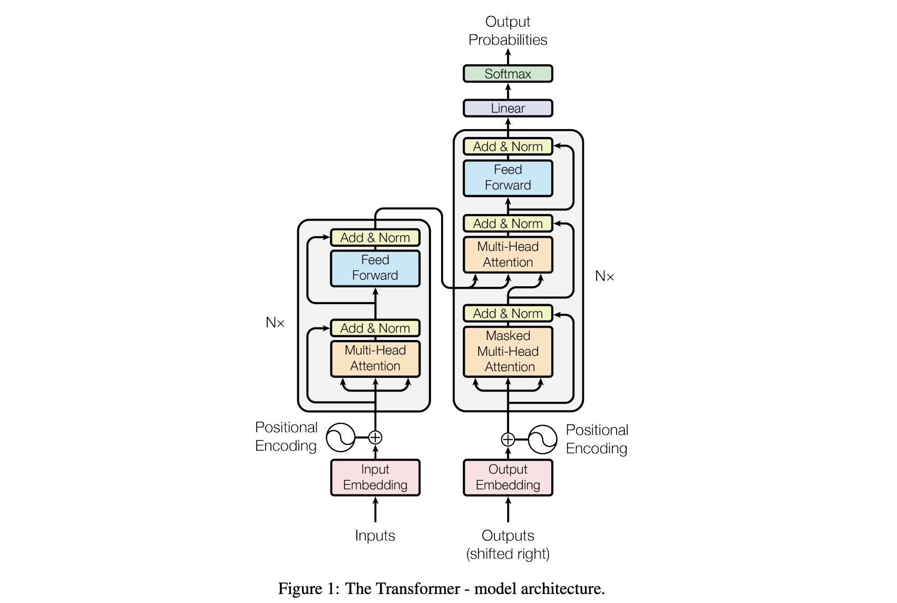

# Attention Is All You Need

> Vaswani et al., 2017 · [arXiv:1706.03762](https://arxiv.org/abs/1706.03762) · NeurIPS 2017

## 论文简介

你大概率听过这篇文章的名字，也大概率看过上面这张图，没错，这个就出自Attention Is All You Need，尽管这已经是一篇可以说是远古时代的文章，但魅力不减。

这篇论文提出了 **Transformer** 架构，彻底抛弃了 RNN 和卷积，仅凭注意力机制就实现了当时最优的机器翻译效果。它是现代几乎所有大语言模型（GPT、BERT、Claude……)的直接祖先，可以说是近十年深度学习领域影响最深远的论文之一。

## 整体架构

Transformer 是一个标准的**编码器-解码器（Encoder-Decoder）**结构：

- **编码器**：6 层堆叠，每层含两个子层——多头自注意力 + 位置前馈网络
- **解码器**：同样 6 层，每层含三个子层——掩码多头自注意力 + 编码器-解码器注意力 + 位置前馈网络

每个子层外都套着**残差连接**和**层归一化（Layer Norm）**。

## 核心机制

### 1. 缩放点积注意力

$$
\text{Attention}(Q, K, V) = \text{softmax}\!\left(\frac{QK^\top}{\sqrt{d_k}}\right)V
$$

$Q$（Query）、$K$（Key）、$V$（Value）是输入经过线性变换得到的矩阵。除以 $\sqrt{d_k}$ 是为了防止点积过大导致 softmax 梯度消失。

### 2. 多头注意力（Multi-Head Attention）

与其用一组 $Q, K, V$ 做一次注意力，不如把它们拆成 $h=8$ 份，每份在 $d_k = 64$ 维的子空间里独立学习，最后拼回来：

$$
\text{MultiHead}(Q,K,V) = \text{Concat}(\text{head}_1,\dots,\text{head}_h)\,W^O
$$

这样模型可以同时从不同的"视角"关注序列的不同位置。

### 3. 位置编码（Positional Encoding）

Transformer 没有 RNN 那样天然的顺序感，所以需要手动注入位置信息。论文使用正余弦函数：

$$
PE_{(pos,\,2i)} = \sin\!\left(\frac{pos}{10000^{2i/d_{\text{model}}}}\right), \quad PE_{(pos,\,2i+1)} = \cos\!\left(\frac{pos}{10000^{2i/d_{\text{model}}}}\right)
$$

不同频率的正弦波让模型能区分绝对位置，也能通过线性组合推断相对位置。

### 4. 位置前馈网络（FFN）

每个位置独立地通过同一个两层全连接网络：

$$\text{FFN}(x) = \max(0,\, xW_1 + b_1)\,W_2 + b_2$$

隐层维度 $d_{ff}=2048$，是模型维度 $d_{\text{model}}=512$ 的 4 倍。

## 关键超参数

| 参数 | 值 |
|------|-----|
| 模型维度 $d_{\text{model}}$ | 512 |
| 编码器/解码器层数 | 6 |
| 注意力头数 $h$ | 8 |
| 每头维度 $d_k = d_v$ | 64 |
| FFN 隐层维度 $d_{ff}$ | 2048 |
| Dropout | 0.1 |

## 为什么重要

1. **并行化**：RNN 必须按时间步顺序计算，Transformer 的自注意力可以全序列同时算，训练速度大幅提升。
2. **长距离依赖**：自注意力让任意两个位置的交互都只需 $O(1)$ 步，RNN 则需要 $O(n)$ 步传递。
3. **通用性**：仅凭这篇论文的基础结构，后续衍生出了 BERT（编码器）、GPT 系列（解码器）、T5 等几乎所有现代大模型。

## 读后感

由于太过于经典，以至于网上有很多对这篇文章的解读和样例代码，以至于我读本篇次数反而不多，只完整看过一遍，因此也没啥特别要说的，如果想搞懂注意力机制是怎么运行的，建议去看3blue1brown的动画视频。
