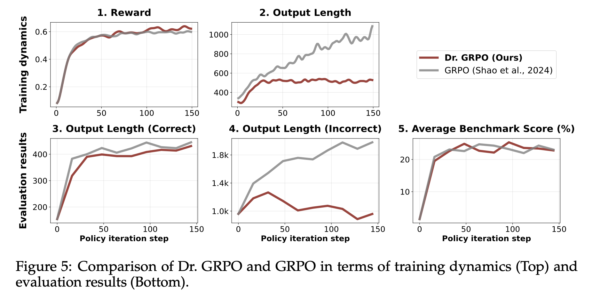

# Understanding R1-Zero-Like Training: A Critical Perspective

## 论文简介

这篇论文主要讲了后训练中使用GRPO可能会遇到的问题以及解决方法。GRPO在DeepSeek R1以及之后的带思维链模型中取得巨大成功，证明了纯RL在解决复杂任务，尤其是如数学类等推理任务上的极高上限，其中DeepSeek创新性地用到了它他们提出的GRPO。

这篇文章探讨了原版GRPO的优点与缺点，并提出改进方式Dr.GRPO。原版GRPO的归一化操作容易导致模型倾向输出简短而正确、错误且冗长的答案，本论文提到的新方法能够在保持答案正确率差不多的情况下，大幅减少答案错误时引发的超长思维链情况，从而降低吐（token）消耗，优化用户体验和训练效果与稳定性。

## 读后感

不错的文章，有工程上的实操意义。
