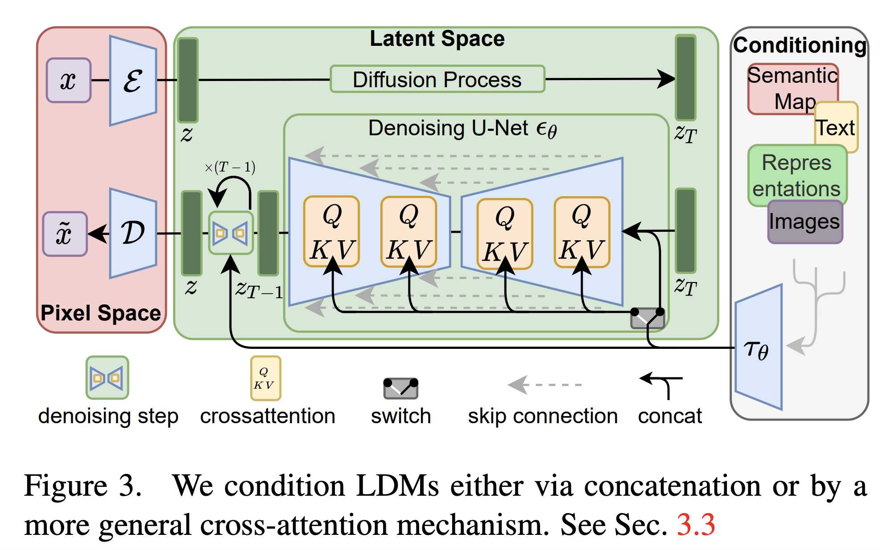

# Latent Diffusion Models 隐空间扩散模型

文章地址：https://arxiv.org/abs/2112.10752


## 1、读后感

这篇论文是如此经典，以至于很难没见过它。什么，你真没见过？那下面这张图你大概率是见过的：

{ style="zoom:25%;" }


这张最经典的图就是出自这篇论文。这篇论文主要讲的就是图片集空间在一个很高维空间里，但实际上只是里面的一个低维流形，所以有没有办法把这个流形在进行一定程度保形映射，到一个低维空间去呢？因为这样就只需要在一个低维度上训练，极大节省计算量和训练、推理时间。这篇文章的结论是：可以，只需要用一个VAE就行，想法既简单又自然。

完全复刻文章中训练出来的模型至少需要4卡A100，以及二三十天的训练时间。听起来很夸张，但相比原来的模型已经快了几十倍了。当然，如果你不需要完美复刻，只是想在一个小一点的数据集上，比如MINST、COCO这种，那大概用5090跑几天甚至几个小时就结束了。想练手并没有想象中那么难。当然，微调可能是更好的选择，两三个小时就搞定了。


## 2、论文精讲 by Claude Opus 4.6 

这篇论文提出了**潜在扩散模型（Latent Diffusion Models, LDMs）**，也就是后来大名鼎鼎的 **Stable Diffusion** 的基础工作。核心思路可以用一句话概括：

**把扩散模型从像素空间搬到压缩后的潜在空间里运行，从而大幅降低计算成本，同时保持生成质量。**

具体来说，论文解决的问题和方法如下：

**问题：** 传统扩散模型（如 DDPM）直接在高分辨率像素空间上做去噪，计算量极大，训练和推理都非常昂贵。

**解决方案分两步：**

1. **压缩阶段** — 先用一个预训练的自编码器（autoencoder）把图像压缩到低维的潜在空间（latent space）。编码器把图像压小，解码器再还原回来。这个压缩保留了图像的核心语义信息，去掉了大量感知上不重要的高频细节。
2. **扩散阶段** — 在这个压缩后的潜在空间里训练扩散模型（加噪→去噪）。因为操作的"画布"小了很多（比如从 512×512 压到 64×64），计算量大幅下降。

**条件生成的关键设计：** 论文引入了**交叉注意力（cross-attention）**机制，让模型可以接受文本、语义图、布局等各种条件输入来引导生成。这就是后来文生图（text-to-image）能力的基础。

**成果：** LDMs 在图像修复（inpainting）、超分辨率、文生图等多个任务上达到了当时最优水平，同时训练资源需求比像素空间的扩散模型低得多——让普通研究者也能训练和使用高质量的图像生成模型。


### 《High-Resolution Image Synthesis with Latent Diffusion Models》精读笔记

> **作者**：Robin Rombach, Andreas Blattmann, Dominik Lorenz, Patrick Esser, Björn Ommer
>  **机构**：Ludwig Maximilian University of Munich & IWR, Heidelberg University; Runway ML
>  **发表**：CVPR 2022（arXiv: 2112.10752）
>  **地位**：这篇论文就是 **Stable Diffusion** 的奠基论文，是 AI 图像生成领域最具影响力的工作之一。

------

### 一、论文要解决什么问题？

#### 1.1 背景：扩散模型很强，但太贵

扩散模型（Diffusion Models, DMs）在图像生成领域已经取得了最优结果，超越了 GAN、VAE 和自回归模型。但它有一个致命问题：**计算成本极高**。

- **训练贵**：最强的扩散模型（如 ADM）训练需要 150～1000 个 V100 GPU 天
- **推理慢**：生成一张图需要跑 25～1000 步去噪，在单张 A100 上生成 50k 张样本大约需要 5 天
- **根本原因**：传统扩散模型直接在像素空间（pixel space）操作，每一步都要在高维 RGB 图像上做前向/反向传播

> **💡 难点解释：什么是"像素空间"？**
>  一张 512×512 的 RGB 图像有 512×512×3 = 786,432 个数值。扩散模型每一步去噪都要在这 78 万维空间上运行整个神经网络。这就好比你想编辑一篇文章的主题思想，却不得不逐字逐句地修改每一个字——效率极低。

#### 1.2 关键洞察：图像的两种压缩

论文作者分析了已训练的像素空间扩散模型，发现学习过程可以分为两个阶段：

1. **感知压缩（Perceptual Compression）**：去除高频细节（如细微纹理、噪声），这些细节人眼几乎感知不到
2. **语义压缩（Semantic Compression）**：学习数据的语义结构和概念组成（如"一只猫坐在桌上"）

**核心思路**：既然扩散模型花了大量算力在"感知压缩"这件人眼都分辨不出的事情上，何不把这件事交给一个单独的压缩模型来做，让扩散模型专注于"语义压缩"？

------

### 二、方法：Latent Diffusion Models (LDMs)

LDM 的整体架构分为两个阶段，非常清晰：

#### 2.1 第一阶段：感知压缩——训练自编码器

**目标**：把图像压缩到一个低维的「潜在空间」（latent space），去掉人眼不敏感的信息，保留核心视觉内容。

**架构**：

- **编码器 E**：将图像 x ∈ ℝ^{H×W×3} 编码为潜在表示 z = E(x) ∈ ℝ^{h×w×c}
- **解码器 D**：从潜在表示重建图像 x̃ = D(z) = D(E(x))
- **下采样因子 f = H/h = W/w**：例如 f=4 意味着 512×512 的图变成 128×128 的潜在表示；f=8 则变成 64×64

**训练目标**（多项损失联合）：

$$\mathcal{L}*{\text{Autoencoder}} = \min*{E,D} \max_{\psi} \Big( \mathcal{L}*{\text{rec}} + \mathcal{L}*{\text{reg}} - \mathcal{L}*{\text{adv}}(D(E(x))) + \log D*\psi(x) \Big)$$

各项含义：

| 损失项                                        | 作用                                          |
| --------------------------------------------- | --------------------------------------------- |
| $\mathcal{L}_{\text{rec}}$                    | 重建损失，让输出和输入尽量一致                |
| $\mathcal{L}_{\text{reg}}$                    | 正则化损失，防止潜在空间退化（方差爆炸等）    |
| $\mathcal{L}*{\text{adv}}$ + $\log D*\psi(x)$ | 对抗损失 + 判别器，确保重建图像真实，避免模糊 |

**正则化有两种方式**：

- **KL 正则化**：像 VAE 一样，让潜在分布接近标准正态分布 $\mathcal{N}(0,1)$，但权重极小（~10⁻⁶）
- **VQ 正则化**：像 VQ-GAN 一样，使用向量量化码本

> **💡 难点解释：为什么正则化权重这么小？**
>  传统 VAE 的 KL 正则化会强力约束潜在空间，代价是重建质量下降（"模糊"）。本文发现只需要极轻微的正则化就够了——因为后续的扩散模型本身就能很好地建模潜在空间的分布，不需要潜在空间严格服从标准正态。这是 LDM 相比传统 VAE 的一个重要优势：**解耦了重建质量和生成能力的权衡**。

#### 2.2 第二阶段：潜在扩散——在压缩空间中训练扩散模型

自编码器训练好后固定参数，在其潜在空间中训练扩散模型。

**前向过程**（加噪）：对潜在表示 z 逐步添加高斯噪声

$$q(z_t | z_0) = \mathcal{N}(z_t; \alpha_t z_0, \sigma_t^2 I)$$

**训练目标**：训练一个去噪网络 $\epsilon_\theta$ 预测加入的噪声

$$\mathcal{L}*{\text{LDM}} = \mathbb{E}*{E(x), \epsilon \sim \mathcal{N}(0,1), t} \Big[ | \epsilon - \epsilon_\theta(z_t, t) |_2^2 \Big]$$

**生成流程**：

1. 从标准正态分布采样一个随机噪声 $z_T$
2. 用训练好的去噪网络逐步去噪：$z_T → z_{T-1} → \cdots → z_0$
3. 用解码器一步还原为图像：$\tilde{x} = D(z_0)$

> **💡 难点解释：为什么在潜在空间做扩散效率更高？**
>  以 f=8 为例：
>
> - 像素空间：操作 512×512×3 = **786,432** 维数据
> - 潜在空间：操作 64×64×4 = **16,384** 维数据
> - 数据量缩小了 **48 倍**！
>
> 而且 UNet 的计算量大致与空间分辨率的平方成正比，所以实际加速远不止 48 倍。关键是，被丢掉的那些信息（高频细节）对人眼来说几乎不可见。

#### 2.3 条件生成机制——交叉注意力（Cross-Attention）

这是论文的第二个核心贡献：设计了一个**通用的条件注入机制**，让 LDM 可以根据各种输入（文本、语义图、布局框等）来引导生成。

**机制**：

1. 条件输入 y（如文本）先通过一个**领域特定编码器** $\tau_\theta$ 映射为中间表示 $\tau_\theta(y) \in \mathbb{R}^{M \times d_\tau}$
   - 对于文本：$\tau_\theta$ 是一个 Transformer（使用 BERT tokenizer）
   - 对于类别标签：$\tau_\theta$ 是一个可学习的嵌入层
   - 对于布局：将边界框坐标离散化后编码
2. 在 UNet 的中间层插入**交叉注意力层**：

$$\text{Attention}(Q, K, V) = \text{softmax}\left(\frac{QK^T}{\sqrt{d}}\right) \cdot V$$

其中：

- $Q = W_Q^{(i)} \cdot \varphi_i(z_t)$（查询来自 UNet 的特征图）
- $K = W_K^{(i)} \cdot \tau_\theta(y)$（键来自条件编码）
- $V = W_V^{(i)} \cdot \tau_\theta(y)$（值来自条件编码）

> **💡 难点解释：交叉注意力在这里干了什么？**
>  可以这样理解：UNet 在去噪时，每一层都会"询问"条件信息——"你想要什么样的图？"。Query 是图像特征的"问题"，Key 和 Value 是条件信息的"回答"。通过注意力机制，图像的每个空间位置都能选择性地关注条件中最相关的部分。
>
> 比如在文生图中，生成天空区域的像素时，注意力会更多地关注 "blue sky" 这样的词；生成猫的区域时，会关注 "cat" 这个词。

**两种条件注入方式对比**：

| 方式                              | 适用场景                           | 原理                       |
| --------------------------------- | ---------------------------------- | -------------------------- |
| **拼接（Concatenation）**         | 空间对齐的条件（低分辨率图、遮罩） | 直接把条件拼接到 UNet 输入 |
| **交叉注意力（Cross-Attention）** | 非空间条件（文本、类别）           | 通过注意力机制融合         |

------

### 三、关键实验与发现

#### 3.1 下采样因子 f 的最佳选择

论文系统地对比了 f ∈ {1, 2, 4, 8, 16, 32}（LDM-1 就是普通像素空间扩散模型）：

| 下采样因子 f  | 表现                               |
| ------------- | ---------------------------------- |
| f = 1, 2      | 训练极慢，大量算力浪费在感知压缩上 |
| **f = 4 ~ 8** | **最佳平衡点**——效率高、质量好     |
| f = 16, 32    | 压缩太狠，信息丢失严重，质量饱和   |

> 在 ImageNet 上训练 2M 步后，LDM-8 的 FID 比像素空间的 LDM-1 低了 38 分，同时训练速度快了数倍。

#### 3.2 无条件图像生成

在多个数据集上与 SOTA 方法对比（FID 越低越好）：

| 数据集             | LDM      | 之前最优       | 备注                       |
| ------------------ | -------- | -------------- | -------------------------- |
| CelebA-HQ 256²     | **5.11** | LSGM 7.22      | 超越所有扩散和 VAE 方法    |
| FFHQ 256²          | **4.98** | UDM 5.54       | 接近 ProjectedGAN (3.08)   |
| LSUN-Churches 256² | **4.02** | StyleGAN2 3.86 | 非常接近                   |
| LSUN-Bedrooms 256² | **2.95** | ADM 1.90       | 略逊于 ADM，但参数量仅一半 |

#### 3.3 文本到图像生成（Text-to-Image）

在 MS-COCO 256² 上（使用 1.45B 参数的 KL-正则化 LDM-8）：

| 方法                   | FID↓      | 参数量    |
| ---------------------- | --------- | --------- |
| CogView                | 27.10     | 4B        |
| LAFITE                 | 26.94     | 75M       |
| GLIDE                  | 12.24     | **6B**    |
| Make-A-Scene           | 11.84     | **4B**    |
| **LDM-KL-8-G（本文）** | **12.63** | **1.45B** |

> 关键发现：LDM 在参数量仅为 GLIDE 的 1/4 的情况下，达到了几乎相同的性能。这正是"潜在空间"策略的威力。

#### 3.4 类别条件生成（Class-Conditional, ImageNet）

| 方法                     | FID↓     | IS↑        | 参数量   |
| ------------------------ | -------- | ---------- | -------- |
| ADM-G (引导)             | 4.59     | 186.7      | 608M     |
| **LDM-4-G (本文, 引导)** | **3.60** | **247.67** | **400M** |

> **LDM 以更少的参数量击败了 ADM-G**，取得了当时 ImageNet 类别条件生成的新 SOTA。

#### 3.5 图像修复（Inpainting）

对比专门为修复设计的 LaMa 模型：

| 指标               | LaMa  | LDM-4 (本文)    |
| ------------------ | ----- | --------------- |
| FID (全图)         | —     | **1.50** (SOTA) |
| 用户偏好（Task 2） | 31.9% | **68.1%**       |

> LDM 不仅 FID 更优，而且在人类评测中以压倒性优势获胜。更重要的是，LDM 是**通用生成模型**，而 LaMa 是专门为修复设计的架构。

#### 3.6 超分辨率（Super-Resolution, 4× 放大）

| 方法             | FID↓    | IS↑   | 参数量 |
| ---------------- | ------- | ----- | ------ |
| SR3              | 5.2     | 180.1 | 625M   |
| **LDM-4 (本文)** | **2.8** | 166.3 | 169M   |

> LDM 在 FID 上大幅超越 SR3，且参数量仅为其 1/4。用户研究中，70.6% 的人更偏好 LDM 的结果。

#### 3.7 效率对比

在图像修复任务上，LDM-4 vs 像素空间扩散模型 LDM-1：

| 指标              | LDM-1（像素空间） | LDM-4（潜在空间）            |
| ----------------- | ----------------- | ---------------------------- |
| 训练吞吐量        | 0.11 samples/sec  | **0.32 samples/sec**（2.9×） |
| 采样吞吐量 (256²) | 0.26 samples/sec  | **0.97 samples/sec**（3.7×） |
| 采样吞吐量 (512²) | 0.07 samples/sec  | **0.34 samples/sec**（4.9×） |
| FID (6 epochs)    | 24.74             | **15.21**（质量也更好）      |

------

### 四、技术细节补充

#### 4.1 UNet 骨干网络

去噪网络 $\epsilon_\theta$ 使用的是带时间条件的 UNet：

- 基于 "ablated UNet"（来自 DDPM/ADM 的简化版）
- 使用 2D 卷积层（利用图像的空间归纳偏置）
- 含跳跃连接（skip connections）
- 在 UNet 的特征层级上加入 self-attention 和 cross-attention

#### 4.2 采样策略

论文使用 **DDIM（Denoising Diffusion Implicit Models）** 采样器来加速推理，通常使用 50～250 步（而非原始 DDPM 的 1000 步）。

#### 4.3 Classifier-Free Guidance（无分类器引导）

用于提升条件生成质量的关键技巧：

- 训练时以一定概率丢弃条件（unconditional training）
- 推理时同时预测有条件和无条件的噪声，用引导系数 s 控制偏向：

$$\hat{\epsilon} = \epsilon_\theta(z_t, t) + s \cdot (\epsilon_\theta(z_t, t, y) - \epsilon_\theta(z_t, t))$$

s > 1 时会让生成结果更贴合条件描述，但牺牲一些多样性。

> **💡 难点解释：为什么 classifier-free guidance 有效？**
>  直觉上，这相当于"把有条件方向和无条件方向的差值放大"。如果条件是"一只猫"，引导会让模型更加坚定地朝"猫"的方向生成，远离那些"什么都可能是"的模糊区域。s 越大，结果越精准但越不多样。

------

### 五、局限性

论文诚实地指出了几个局限：

1. **仍然比 GAN 慢**：虽然比像素空间扩散模型快很多，但序列化的去噪过程仍不如 GAN 的单步前向
2. **精度上限**：自编码器的重建能力成为瓶颈——当任务需要像素级精确时（如超分辨率的极细纹理），f=4 的压缩会导致细节损失
3. **社会影响**：高质量图像生成技术的双刃剑问题——创作赋能 vs. 深度伪造

------

### 六、总结：为什么这篇论文如此重要？

| 贡献                       | 意义                                                       |
| -------------------------- | ---------------------------------------------------------- |
| **将扩散过程搬到潜在空间** | 计算成本降低数倍，首次让高质量扩散模型在消费级硬件上可行   |
| **解耦压缩与生成**         | 自编码器训练一次，可复用于多种任务和不同扩散模型           |
| **通用交叉注意力条件机制** | 文本、布局、语义图等多模态条件都可以统一接入               |
| **开源**                   | 代码和预训练模型全部公开，直接催生了 Stable Diffusion 生态 |

这篇论文的核心洞察可以浓缩为一句话：**在一个"对人眼来说等价"的低维空间里做扩散，比在原始像素空间里做扩散，又快又好。** 这个看似简单的想法，加上精心的工程设计（自编码器的训练方式、交叉注意力的引入、适当的压缩比选择），最终彻底改变了 AI 图像生成的格局。


## 3、实验与训练

如果是一个学生，该怎么试呢？我们来看看Claude的建议：

### 推荐方案：在 MNIST 或 CelebA 上训练小型 LDM

#### 硬件要求

| 配置                     | 是否够用       |
| ------------------------ | -------------- |
| 单张 RTX 3060 12GB       | ✅ 够用（较慢） |
| 单张 RTX 3090/4090 24GB  | ✅ 舒适         |
| Google Colab Pro（A100） | ✅ 推荐，免硬件 |
| 没有 GPU，只有 CPU       | ❌ 不现实       |

如果你没有本地 GPU，**Colab Pro 约 $10/月，是最低成本的入门方式**。

------

### 分阶段来做

#### 第一步：先不用 Latent，直接训一个 DDPM

在正式搞 LDM 之前，强烈建议先在 **MNIST（28×28）或 CIFAR-10（32×32）** 上跑通一个基础扩散模型：

- 参数量极小，1 张普通 GPU 跑几个小时就能出结果
- 让你真正理解前向加噪 / 反向去噪的训练循环
- 有大量现成代码可以直接用

推荐项目：[denoising-diffusion-pytorch](https://github.com/lucidrains/denoising-diffusion-pytorch)，几十行配置就能跑起来。

------

#### 第二步：复现小规模 LDM

在跑通基础 DDPM 之后，再加上 VAE 压缩这一层，就是完整的 LDM 流程。

**推荐数据集**：CelebA，64×64 分辨率裁剪版，约 20 万张人脸，下载约 1.4GB，规模合适。

**大致训练配置**：

| 阶段      | 内容                    | 时间估计（RTX 3090） |
| --------- | ----------------------- | -------------------- |
| 1. 训 VAE | 把 64×64 图压到 16×16×4 | 约 6-12 小时         |
| 2. 训 LDM | 在潜在空间跑扩散        | 约 1-3 天            |

分辨率 64×64 → 潜在空间 16×16，UNet 参数量可以压到 **50M 以下**，完全在消费级显卡上跑。

------

#### 第三步：加条件（可选）

如果想体验带条件的生成（比如按类别生成），CelebA 有性别、年龄、表情等 40 个属性标注，可以用类别标签做条件，体验 CFG 的效果。

------

#### 现成代码推荐

| 项目                                                         | 特点                             |
| ------------------------------------------------------------ | -------------------------------- |
| [CompVis/latent-diffusion](https://github.com/CompVis/latent-diffusion) | 论文官方代码，最权威，但配置复杂 |
| [lucidrains/denoising-diffusion-pytorch](https://github.com/lucidrains/denoising-diffusion-pytorch) | 代码极简洁，适合入门             |
| [huggingface/diffusers](https://github.com/huggingface/diffusers) | 工程化最好，有大量教程           |

对于复现入门，**建议从 lucidrains 的仓库开始**，代码量少、注释清晰，跑通之后再去看官方代码。

------

#### 最小可行路线总结

```
Week 1：跑通 DDPM on MNIST/CIFAR-10
Week 2：训 VAE on CelebA 64×64，验证重建效果
Week 3：在 VAE 潜在空间上训扩散模型
Week 4：加条件 + 体验 CFG
```

四周左右你就能有一个完整的、自己训出来的小型 LDM。


## 4、附全文重点翻译

### 基于潜在扩散模型的高分辨率图像合成

**Robin Rombach¹\* · Andreas Blattmann¹\* · Dominik Lorenz¹ · Patrick Esser · Björn Ommer¹**

¹ 慕尼黑路德维希·马克西米利安大学 & 海德堡大学 IWR，德国；Runway ML

https://github.com/CompVis/latent-diffusion

------

#### 摘要

通过将图像生成过程分解为去噪自编码器的序列化应用，扩散模型（DM）在图像数据及其他领域上取得了最先进的合成结果。此外，其公式化方式允许在无需重新训练的情况下，通过一种引导机制来控制图像生成过程。然而，由于这些模型通常直接在像素空间中运行，强大扩散模型的优化往往需要消耗数百个 GPU 天，且由于需要顺序求值，推理代价也十分昂贵。为了在有限计算资源下实现扩散模型训练，同时保留其质量与灵活性，我们将扩散模型应用于强大的预训练自编码器的潜在空间中。与此前工作不同，在这样的表示空间上训练扩散模型，首次使得在复杂度降低与细节保留之间达到近乎最优的平衡点成为可能，从而大幅提升了视觉保真度。通过在模型架构中引入交叉注意力层，我们将扩散模型转变为功能强大且灵活的生成器，能够接受文本或边界框等通用条件输入，并以卷积方式实现高分辨率图像合成。我们的潜在扩散模型（LDM）在图像修复和类条件图像合成方面取得了新的最先进分数，在文本到图像合成、无条件图像生成和超分辨率等多项任务上也表现出极具竞争力的性能，同时相较于基于像素的扩散模型，显著降低了计算需求。

------

#### 1. 引言

图像合成是计算机视觉领域近年来发展最为壮观的方向之一，但也是计算需求最大的方向之一。尤其是复杂自然场景的高分辨率合成，目前主要由不断扩大规模的基于似然的模型所主导，这些模型可能包含自回归（AR）Transformer 中的数十亿参数 [66, 67]。相比之下，GAN [3, 27, 40] 的有前景的结果已被证明大多局限于变化相对有限的数据，因为其对抗学习过程不容易扩展到对复杂多模态分布的建模。最近，扩散模型 [82] 由去噪自编码器的层次结构构建而成，已在图像合成 [30, 85] 及其他领域 [7, 45, 48, 57] 取得了令人印象深刻的结果，并在类条件图像合成 [15, 31] 和超分辨率 [72] 方面定义了最先进水平。此外，即使是无条件扩散模型也可以直接用于图像修复和着色 [85] 或基于笔触的合成 [53] 等任务，这与其他类型的生成模型不同 [19, 46, 69]。作为基于似然的模型，它们不像 GAN 那样表现出模式崩溃和训练不稳定性，并且通过大量利用参数共享，可以在不涉及自回归模型 [67] 中数十亿参数的情况下对自然图像的高度复杂分布进行建模。

**普及高分辨率图像合成。** 扩散模型属于基于似然的模型，其模式覆盖行为使其容易将过多的容量（以及计算资源）花费在对数据中难以察觉的细节的建模上 [16, 73]。尽管重加权变分目标 [30] 旨在通过对初始去噪步骤进行欠采样来解决这一问题，但扩散模型在计算上仍然要求很高，因为训练和评估此类模型需要在 RGB 图像的高维空间中进行反复的函数求值（以及梯度计算）。举例而言，训练最强大的扩散模型通常需要数百个 GPU 天（例如 [15] 中需要 150 到 1000 个 V100 天），而在输入空间噪声版本上的反复评估也使推理代价高昂——生成 50,000 个样本在单张 A100 GPU 上大约需要 5 天 [15]。这对研究界和普通用户产生了两方面影响：其一，训练此类模型需要只有极少数人才能获取的大量计算资源，同时留下巨大的碳足迹 [65, 86]；其二，评估一个已训练好的模型也在时间和内存上代价高昂，因为相同的模型架构必须顺序运行大量步骤（例如 [15] 中为 25 到 1000 步）。

为了提高这一强大模型类别的可及性，同时降低其显著的资源消耗，我们需要一种能够降低训练和采样计算复杂度的方法。因此，在不损害性能的前提下降低扩散模型的计算需求，是提升其可及性的关键。

**迈向潜在空间。** 我们的方法从分析已在像素空间训练好的扩散模型开始：图 2 展示了一个训练模型的率失真权衡。与任何基于似然的模型一样，学习过程大致可以分为两个阶段：首先是感知压缩阶段，该阶段去除高频细节，但仍学到少量语义变化；在第二阶段，实际的生成模型学习数据的语义和概念组成（语义压缩）。因此，我们的目标是首先找到一个在感知上等价但在计算上更为合适的空间，在该空间中训练用于高分辨率图像合成的扩散模型。

遵循通常的做法 [11, 23, 66, 67, 96]，我们将训练分为两个不同的阶段：首先，我们训练一个自编码器，该自编码器提供一个低维（因而高效）的表示空间，在感知上等价于数据空间。重要的是，与此前工作 [23, 66] 不同，我们不需要依赖过度的空间压缩，因为我们在所学的潜在空间中训练扩散模型，该潜在空间在空间维度方面表现出更好的缩放特性。降低的复杂度还通过单次网络前向传播，提供了从潜在空间高效生成图像的能力。我们将得到的模型类称为**潜在扩散模型（LDM）**。

这一方法的一个显著优势是，我们只需训练一次通用的自编码阶段，因此可以将其复用于多次扩散模型训练，或探索完全不同的任务 [81]。这使得对各种图像到图像和文本到图像任务的大量扩散模型进行高效探索成为可能。对于后者，我们设计了一种将 Transformer 连接到扩散模型 UNet 主干 [71] 的架构，并支持任意类型的基于 token 的条件机制，见第 3.3 节。

总而言之，我们的工作做出了以下贡献：

**(i)** 与纯粹基于 Transformer 的方法 [23, 66] 相比，我们的方法能更优雅地扩展到更高维度的数据，因此可以 (a) 在比以往工作更忠实、更详细的压缩水平上工作（见图 1），以及 (b) 可以高效地应用于百万像素图像的高分辨率合成。

**(ii)** 我们在多项任务（无条件图像合成、图像修复、随机超分辨率）和数据集上取得了有竞争力的性能，同时显著降低了计算成本。与基于像素的扩散方法相比，我们也显著降低了推理成本。

**(iii)** 我们表明，与此前同时学习编码器/解码器架构和基于分数的先验的工作 [93] 不同，我们的方法不需要对重建能力和生成能力进行难以权衡的加权。这确保了极其忠实的重建，并且仅需对潜在空间进行极少的正则化。

**(iv)** 我们发现，对于超分辨率、图像修复和语义合成等密集条件任务，我们的模型可以以卷积方式应用，并渲染约 $1024^2$ 像素的大型一致图像。

**(v)** 此外，我们设计了一种基于交叉注意力的通用条件机制，支持多模态训练。我们利用它训练了类条件、文本到图像和布局到图像模型。

**(vi)** 最后，我们在 https://github.com/CompVis/latent-diffusion 发布了预训练的潜在扩散模型和自编码模型，这些模型可能可复用于扩散模型训练 [81] 之外的各种任务。

------

#### 2. 相关工作

**图像合成的生成模型。** 图像的高维特性对生成建模提出了独特的挑战。生成对抗网络（GAN）[27] 允许高效采样具有良好感知质量的高分辨率图像 [3, 42]，但难以优化 [2, 28, 54]，且难以捕捉完整的数据分布 [55]。相比之下，基于似然的方法强调良好的密度估计，使优化过程更加稳定。变分自编码器（VAE）[46] 和基于流的模型 [18, 19] 能够高效合成高分辨率图像 [9, 44, 92]，但样本质量不及 GAN。尽管自回归模型（ARM）[6, 10, 94, 95] 在密度估计方面表现出色，但计算密集型的架构 [97] 和顺序采样过程将其限制于低分辨率图像。由于图像的基于像素的表示包含难以察觉的高频细节 [16, 73]，最大似然训练在对其建模上花费了不成比例的容量，导致训练时间很长。为了扩展到更高分辨率，一些两阶段方法 [23, 67, 101, 103] 使用自回归模型来对压缩后的潜在图像空间而非原始像素进行建模。

最近，扩散概率模型（DM）[82] 在密度估计 [45] 和样本质量 [15] 方面均取得了最先进的结果。这些模型的生成能力源于其底层神经网络主干实现为 UNet [15, 30, 71, 85] 时与图像类数据归纳偏置的自然契合。最佳合成质量通常在使用重加权目标 [30] 进行训练时实现。在这种情况下，扩散模型对应于一个有损压缩器，可以在图像质量和压缩能力之间进行权衡。然而，在像素空间中对这些模型进行评估和优化，存在推理速度慢和训练成本极高的缺点。虽然前者可以通过先进的采样策略 [47, 75, 84] 和层次化方法 [31, 93] 得到部分缓解，但在高分辨率图像数据上训练始终需要计算昂贵的梯度。我们通过提出在低维压缩潜在空间中工作的 LDM 来解决这两个缺点，这使得训练在计算上更加经济，并以几乎不损失合成质量的代价加速了推理（见图 1）。

**两阶段图像合成。** 为了缓解各类生成方法的不足，大量研究 [11, 23, 67, 70, 101, 103] 致力于通过两阶段方法将不同方法的优势结合成更高效、性能更强的模型。VQ-VAE [67, 101] 使用自回归模型在离散化潜在空间上学习一个富有表现力的先验。文献 [66] 通过学习离散化图像和文本表示的联合分布，将这一方法扩展到文本到图像生成。更一般地，文献 [70] 使用条件可逆网络在不同域的潜在空间之间提供通用迁移。与 VQ-VAE 不同，VQGAN [23, 103] 采用具有对抗性和感知目标的第一阶段，将自回归 Transformer 扩展到更大的图像。然而，可行的 ARM 训练所需的高压缩率引入了数十亿可训练参数 [23, 66]，限制了此类方法的整体性能，而降低压缩率则需付出高计算成本的代价 [23, 66]。我们的工作避免了此类权衡，因为我们提出的 LDM 由于其卷积主干，能够更平缓地扩展到更高维的潜在空间。因此，我们可以自由选择最优地在学习强大的第一阶段之间进行调节的压缩水平，既不将过多的感知压缩留给生成扩散模型，又保证高保真度重建（见图 1）。

虽然存在联合 [93] 或分开 [80] 学习编码/解码模型与基于分数的先验的方法，但前者仍然需要在重建能力和生成能力之间进行困难的权衡 [11]，且被我们的方法所超越（第 4 节），而后者则专注于人脸等高度结构化的图像。

------

#### 3. 方法

为了降低训练扩散模型以实现高分辨率图像合成的计算需求，我们注意到，尽管扩散模型允许通过对相应损失项进行欠采样来忽略感知上无关的细节 [30]，但它们在像素空间中仍然需要昂贵的函数求值，这在计算时间和能源资源方面带来了巨大需求。

我们提出通过引入压缩学习阶段与生成学习阶段的显式分离来规避这一缺点（见图 2）。为实现这一点，我们利用一个自编码模型，该模型学习一个在感知上等价于图像空间但提供显著降低计算复杂度的空间。

这种方法具有以下几个优势：**(i)** 通过离开高维图像空间，我们得到了在计算上更高效的扩散模型，因为采样在低维空间中进行。**(ii)** 我们利用扩散模型从其 UNet 架构 [71] 中继承的归纳偏置，这使其对具有空间结构的数据特别有效，从而缓解了以往方法 [23, 66] 所要求的、会导致质量下降的激进压缩水平需求。**(iii)** 最后，我们获得了通用压缩模型，其潜在空间可以用于训练多个生成模型，也可以用于其他下游应用，例如单图像 CLIP 引导合成 [25]。

#### 3.1 感知图像压缩

我们的感知压缩模型基于以往工作 [23]，由一个通过感知损失 [106] 和基于 patch 的 [33] 对抗目标 [20, 23, 103] 组合训练的自编码器组成。这确保了重建被约束在图像流形上，通过强制局部真实感来避免仅依赖像素空间损失（如 L2 或 L1 目标）所引入的模糊性。

更精确地，给定 RGB 空间中的图像 $x \in \mathbb{R}^{H \times W \times 3}$，编码器 $\mathcal{E}$ 将 $x$ 编码为潜在表示 $z = \mathcal{E}(x)$，解码器 $\mathcal{D}$ 从潜在量重建图像，给出 $\tilde{x} = \mathcal{D}(z) = \mathcal{D}(\mathcal{E}(x))$，其中 $z \in \mathbb{R}^{h \times w \times c}$。重要的是，编码器以因子 $f = H/h = W/w$ 对图像进行下采样，我们研究了不同的下采样因子 $f = 2^m$，其中 $m \in \mathbb{N}$。

为了避免任意高方差的潜在空间，我们尝试了两种不同的正则化方式。第一种变体 KL-reg. 对所学潜在量施加轻微的 KL 惩罚，使其趋向标准正态分布，类似于 VAE [46, 69]；而 VQ-reg. 则在解码器中使用向量量化层 [96]。该模型可以被解释为一个 VQGAN [23]，但量化层被吸收在解码器中。由于我们后续的扩散模型被设计为与所学潜在空间 $z = \mathcal{E}(x)$ 的二维结构配合工作，我们可以使用相对温和的压缩率并获得非常好的重建效果。这与此前工作 [23, 66] 不同，后者依赖于对所学空间 $z$ 的任意一维排序来自回归地对其分布进行建模，从而忽略了 $z$ 的大量内在结构。因此，我们的压缩模型能更好地保留 $x$ 的细节（见表 8）。完整的目标函数和训练细节见附录。

#### 3.2 潜在扩散模型

扩散模型 [82] 是概率模型，被设计为通过对正态分布变量逐渐去噪来学习数据分布 $p(x)$，这对应于学习长度为 $T$ 的固定马尔可夫链的逆过程。对于图像合成，最成功的模型 [15, 30, 72] 依赖于 $p(x)$ 变分下界的重加权变体，它与去噪分数匹配 [85] 相映照。这些模型可以被解释为等权重的去噪自编码器序列 $\epsilon_\theta(x_t, t); t = 1 \ldots T$，这些自编码器被训练为预测其输入 $x_t$ 的去噪变体，其中 $x_t$ 是输入 $x$ 的含噪版本。对应的目标函数可以简化为（见附录 B）：

$$\mathcal{L}*{DM} = \mathbb{E}*{x,\epsilon\sim\mathcal{N}(0,1),t}\left[|\epsilon - \epsilon_\theta(x_t, t)|_2^2\right] \tag{1}$$

其中 $t$ 从 ${1, \ldots, T}$ 中均匀采样。

**潜在表示的生成建模。** 借助由 $\mathcal{E}$ 和 $\mathcal{D}$ 组成的已训练感知压缩模型，我们现在可以访问一个高效的低维潜在空间，在该空间中高频、难以察觉的细节已被抽象掉。与高维像素空间相比，该空间更适合基于似然的生成模型，因为它们现在可以 **(i)** 专注于数据中重要的语义比特，并且 **(ii)** 在维度更低、计算上更高效的空间中进行训练。

与此前依赖于在高度压缩的离散潜在空间中使用基于注意力的自回归 Transformer 模型的工作 [23, 66, 103] 不同，我们可以利用我们模型所提供的图像特定归纳偏置。这包括主要由 2D 卷积层构建底层 UNet 的能力，并进一步利用重加权目标将目标集中在感知上最相关的比特上，该目标现在写为：

$$\mathcal{L}*{LDM} := \mathbb{E}*{\mathcal{E}(x),\epsilon\sim\mathcal{N}(0,1),t}\left[|\epsilon - \epsilon_\theta(z_t, t)|_2^2\right] \tag{2}$$

我们模型的神经网络主干 $\epsilon_\theta(\circ, t)$ 以时间条件 UNet [71] 的形式实现。由于前向过程是固定的，$z_t$ 可以在训练时从 $\mathcal{E}$ 中高效获得，而 $p(z)$ 中的样本可以通过对 $\mathcal{D}$ 的单次前向传播解码到图像空间。

#### 3.3 条件机制

与其他类型的生成模型 [56, 83] 类似，扩散模型原则上能够对 $p(z|y)$ 形式的条件分布进行建模。这可以通过条件去噪自编码器 $\epsilon_\theta(z_t, t, y)$ 来实现，并为通过文本 [68]、语义图 [33, 61] 或其他图像到图像翻译任务 [34] 等输入 $y$ 控制合成过程铺平了道路。

然而，在图像合成的背景下，将扩散模型的生成能力与类标签 [15] 或输入图像的模糊变体 [72] 之外的其他类型条件相结合，目前仍是一个探索不足的研究领域。我们通过用交叉注意力机制 [97] 增强扩散模型底层的 UNet 主干，将扩散模型转变为更灵活的条件图像生成器，这对于学习各种输入模态的基于注意力的模型 [35, 36] 是有效的。为了对来自各种模态的 $y$（例如语言提示）进行预处理，我们引入了一个领域特定的编码器 $\tau_\theta$，将 $y$ 投影到中间表示 $\tau_\theta(y) \in \mathbb{R}^{M \times d_\tau}$，然后通过（多头）交叉注意力层将其映射到 UNet 的中间层：

$$\text{Attention}(Q, K, V) = \text{softmax}\left(\frac{QK^T}{\sqrt{d}}\right) \cdot V \tag{3}$$

其中 $Q = W_Q^{(i)} \cdot \varphi_i(z_t)$，$K = W_K^{(i)} \cdot \tau_\theta(y)$，$V = W_V^{(i)} \cdot \tau_\theta(y)$。这里 $\varphi_i(z_t) \in \mathbb{R}^{N \times d_\epsilon^i}$ 表示实现 $\epsilon_\theta$ 的 UNet 的（展平的）中间表示，而 $W_V^{(i)} \in \mathbb{R}^{d \times d_\epsilon^i}$，$W_Q^{(i)} \in \mathbb{R}^{d \times d_\tau}$，$W_K^{(i)} \in \mathbb{R}^{d \times d_\tau}$ 是可学习的投影矩阵。

基于基于图像的条件方式，我们通过拼接对 $\mathcal{E}(y)$ 的空间对齐条件信息进行补充。条件 LDM 的完整学习目标为：

$$\mathcal{L}*{LDM} := \mathbb{E}*{\mathcal{E}(x),y,\epsilon\sim\mathcal{N}(0,1),t}\left[|\epsilon - \epsilon_\theta(z_t, t, \tau_\theta(y))|_2^2\right] \tag{4}$$

其中 $\tau_\theta$ 和 $\epsilon_\theta$ 通过该目标联合优化。这种条件机制非常灵活，因为 $\tau_\theta$ 可以被参数化为特定领域的专家，例如（无掩码的）Transformer，当 $y$ 为文本提示时。

------

#### 4. 实验

潜在扩散模型（LDM）以及它们作为高效、高质量图像合成工具的优势，将在 CelebA-HQ [39]、FFHQ [40]、LSUN-Churches 和 LSUN-Bedrooms [105] 以及 ImageNet [12] 和 COCO [51] 数据集上的无条件和条件实验中进行演示。实验的实现细节和超参数可在附录 E.1 和 E.2 中找到。

##### 4.1 在感知压缩权衡上的探索

我们从感知图像压缩模型开始实验，分析在不同的下采样因子 $f \in {1, 2, 4, 8, 16, 32}$ 下，图像生成模型对压缩率的响应，其中 LDM-1 对应于在像素空间中操作的扩散模型。为了公平比较，我们对所有实验使用相同数量的参数并在 ImageNet 上训练所有模型相同数量的步骤。表 13（附录 E.1.4）和图 5 显示了结果。

在小下采样因子（LDM-1 和 LDM-2）时，训练速度较慢。而在较大的下采样因子（LDM-{16, 32}）时，训练更快，但图像质量受到些许损害。在此范围内——以及对于本文中大多数实验——最佳的权衡点为 $f \in {4, 8}$，这也表明扩散模型特别擅长于对此类空间对齐的"潜在"信号进行建模。我们在附录 D.1 中展示了更多的定性结果，并将 LDM-4 的计算需求与基于像素的扩散模型进行比较。

##### 4.2 图像生成

我们对无条件模型进行训练，使用 CelebA-HQ [39]（256² 分辨率下 30k 张图像）、FFHQ [40]（256² 分辨率下 70k 张图像）、LSUN-Churches（256² 分辨率）和 LSUN-Bedrooms（256² 分辨率）数据集。附录 F 中的表 18 给出了所有模型的详细训练计算需求，并与目前最先进的方法进行了比较。

**CelebA-HQ 和 FFHQ。** 我们在 CelebA-HQ 上以 500 步采样得到 FID 为 5.11，在 FFHQ 上以 200 步采样得到 FID 为 4.98。我们的 LDM-4 模型在 CelebA-HQ 上仅使用了 14.4 个 V100 天，在 FFHQ 上使用了 26 个 V100 天，而 StyleGAN2 在 FFHQ 上使用了约 32 个 V100 天。

**LSUN-Bedrooms。** 在 LSUN-Bedrooms 上，我们的 LDM-4 以 200 步采样获得 FID 为 2.95。相比之下，ADM [15] 的 FID 为 1.9，但使用了 232 个 V100 天，而我们仅使用了约 55 个 V100 天（在单张 A100 上训练约 25 个 A100 天）。

**LSUN-Churches。** 在 LSUN-Churches 上，我们的 LDM-8 以 100 步采样获得 FID 为 4.02，与 StyleGAN2 的 3.86 相当。StyleGAN2 使用了 64 个 V100 天，我们仅使用了 18 个 V100 天。

此外，LDM 在 Precision 和 Recall 方面也一贯优于基于 GAN 的方法，从而证实了其模式覆盖的基于似然的训练目标相对于对抗方法的优势。图 4 中还展示了每个数据集的定性结果。

##### 4.3 条件潜在扩散

###### 4.3.1 用于 LDM 的 Transformer 编码器

通过将基于交叉注意力的条件引入 LDM，我们将其开放给以往未针对扩散模型探索的各种条件模态。对于文本到图像建模，我们在 LAION-400M [78] 上训练一个 1.45B 参数的 KL 正则化 LDM，条件为语言提示。我们使用 BERT 分词器 [14] 并将 $\tau_\theta$ 实现为 Transformer [97]，以推断通过（多头）交叉注意力（第 3.3 节）映射到 UNet 的潜在代码。领域特定的语言表示学习专家与视觉合成的结合产生了一个强大的模型，能够很好地泛化到复杂的、用户自定义的文本提示，见图 8 和图 5。

对于定量分析，我们遵循此前工作，在 MS-COCO [51] 验证集上评估文本到图像生成，我们的模型超越了强大的自回归 [17, 66] 和基于 GAN 的 [109] 方法，见表 2。我们注意到，应用无分类器扩散引导 [32] 极大地提升了样本质量，使得引导后的 LDM-KL-8-G 在文本到图像合成上与最近最先进的自回归 [26] 和扩散模型 [59] 相当，同时显著减少了参数量。为了进一步分析基于交叉注意力的条件机制的灵活性，我们还训练了在 OpenImages [49] 上基于语义布局合成图像的模型，并在 COCO [4] 上进行了微调，见图 8。定量评估和实现细节见附录 D.3。

最后，遵循此前工作 [3, 15, 21, 23]，我们在 ImageNet 上评估了表现最佳的类条件模型，见表 3。在无分类器引导（scale = 1.5）下，我们的 LDM-4 以 250 DDIM 步达到 FID 为 3.60，IS 为 247.67，超越了 ADM-G [15]（FID 4.59）等方法。我们的 LDM-4 总计使用了 271 个 V100 天，远少于 ADM-G 的 962 个 V100 天（生成器 916 天 + 分类器 46 天）。

###### 4.3.2 卷积采样超出训练分辨率

通过将下采样的语义图版本与 $f = 4$ 模型（VQ-reg.，见表 8）的潜在图像表示进行拼接，我们在输入分辨率 256²（从 384² 裁切）上进行训练，但发现我们的模型可以泛化到更大的分辨率，并在以卷积方式评估时可生成高达百万像素分辨率的图像（见图 9）。我们利用这一特性，将第 4.4 节的超分辨率模型和第 4.5 节的图像修复模型也用于生成 512² 到 1024² 之间的大型图像。对于此类应用，潜在空间尺度所引发的信噪比会显著影响结果。我们在附录 D.1 中对此进行了说明，分别对 (i) $f=4$ 模型（KL-reg.）提供的潜在空间和 (ii) 按逐通道标准差缩放后的版本进行了学习。

后者与无分类器引导 [32] 结合，还可以直接为文本条件 LDM-KL-8-G 合成大于 256² 的图像，如图 13 所示。

##### 4.4 使用潜在扩散进行超分辨率

潜在扩散模型可以通过拼接方式直接以低分辨率图像为条件，高效地进行超分辨率训练（参见第 3.3 节）。在第一个实验中，我们遵循 SR3 [72] 并在 ImageNet 上训练一个 4× 上采样模型。我们使用双三次退化，分辨率为 64²→256²。结果如表 5 所示，我们的模型 LDM-4（100 步）在 ImageNet-Val 上获得 FID 为 2.8（验证集特征）/4.8（训练集特征），明显优于 SR3 的 5.2，同时参数量也更少（169M vs 625M），在单张 A100 上的采样吞吐量为 4.62 样本/秒。

由于双三次退化过程不能很好地泛化到不遵循此预处理的图像，我们还通过使用更多样化的退化过程训练了一个通用模型 LDM-BSR。结果见附录 D.6.1。

在用户研究（表 4）中，对于超分辨率任务，受试者在任务 1（与真实图像比较）中更倾向于我们的 LDM-4（30.4%）而非基于像素的 DM（16.0%）；在任务 2（两个生成结果对比）中，受试者偏好 LDM-4 的比例高达 70.6%。

##### 4.5 使用潜在扩散进行图像修复

图像修复是指在已知其余部分的情况下，填充图像的缺失部分的任务。我们评估了我们的通用条件图像生成方法与针对此任务的更专业的最先进方法的比较。我们的评估遵循 LaMa [88] 的协议，LaMa 是一种引入基于快速傅里叶卷积 [8] 的专用架构的最近图像修复模型。在 Places [108] 上的确切训练和评估协议见附录 E.2.2。

我们首先分析了第一阶段不同设计选择的影响。特别地，我们比较了 LDM-1（即基于像素的条件 DM）和 LDM-4 在 KL 和 VQ 正则化方面的修复效率，以及不在第一阶段使用注意力的 VQ-LDM-4（见表 8），后者可以在高分辨率解码时减少 GPU 内存。为了可比性，我们固定所有模型的参数量。表 6 报告了在分辨率 256² 和 512² 下的训练和采样吞吐量、每轮训练的总时间（小时）以及六轮后在验证集上的 FID 分数。总体而言，我们观察到基于像素与基于潜在空间的扩散模型之间至少有 2.7× 的速度提升，同时 FID 分数至少提升了 1.6×。

与表 7 中其他图像修复方法的比较表明，我们带注意力的模型改善了以 FID 衡量的总体图像质量，优于文献 [88]。未遮罩图像与我们样本之间的 LPIPS 略高于 [88]，我们将此归因于 [88] 只产生一个结果，倾向于恢复更平均的图像，而我们的 LDM 产生的是多样化结果（见图 21）。此外，在用户研究（表 4）中，对于图像修复任务，受试者偏好我们结果的比例在任务 2 中达到 68.1%，而 LaMa 仅为 31.9%。

基于这些初步结果，我们还在不带注意力的 VQ 正则化第一阶段的潜在空间中训练了一个更大的扩散模型（表 7 中的"big"）。遵循 [15]，该扩散模型的 UNet 在其特征层次的三个级别上使用注意力层，并使用 BigGAN [3] 残差块（总参数量为 387M，而非 215M）。训练后，我们注意到在 256² 和 512² 分辨率下产生的样本质量存在差异，我们认为这是由额外的注意力模块引起的。然而，在 512² 分辨率下对模型微调半轮，允许模型适应新的特征统计，并在图像修复上创造了新的最先进 FID（表 7 中 big, w/o attn, w/ ft，图 11）。该模型在所有样本上的 FID 为 1.50，LPIPS 为 0.137，超越了 LaMa [88]（FID 2.21，LPIPS 0.14）和 CoModGAN [107]（FID 1.82）等方法。

------

#### 5. 局限性与社会影响

**局限性。** 尽管 LDM 与基于像素的方法相比显著降低了计算需求，但其顺序采样过程仍然比 GAN 慢。此外，当需要高精度时，使用 LDM 可能存在疑问：尽管在我们的 $f = 4$ 自编码模型中图像质量损失非常小（见图 1），但其重建能力可能成为需要像素空间精细精度的任务的瓶颈。我们推测我们的超分辨率模型（第 4.4 节）在这方面已经受到一定程度的限制。

**社会影响。** 像图像这样的媒体生成模型是一把双刃剑：一方面，它们支持各种创意应用，特别是像我们这样降低训练和推理成本的方法，有潜力促进对这一技术的访问并推动其普及探索。另一方面，这也意味着创建和传播被操纵的数据或传播错误信息与垃圾邮件变得更加容易。特别是，故意操纵图像（"深度伪造"）是这一背景下的常见问题，女性尤其受到其不成比例的影响 [13, 24]。

生成模型还可能泄露其训练数据 [5, 90]，当数据包含敏感或个人信息且未经明确同意收集时，这令人十分担忧。然而，这在多大程度上也适用于图像扩散模型，目前尚未完全理解。

最后，深度学习模块往往会重现或加剧数据中已存在的偏见 [22, 38, 91]。尽管扩散模型比基于 GAN 的方法实现了更好的数据分布覆盖，但我们结合了对抗训练和基于似然目标的两阶段方法在多大程度上错误表示了数据，仍然是一个重要的研究问题。

关于深度生成模型伦理考量的更一般、更详细的讨论，见 [13]。

------

#### 6. 结论

我们提出了潜在扩散模型，这是一种简单而高效的方法，可以在不降低质量的前提下显著提升去噪扩散模型的训练和采样效率。基于此以及我们的交叉注意力条件机制，我们的实验能够证明，在广泛的条件图像合成任务中，无需特定任务架构，即可获得优于最先进方法的结果。

本工作受到德国联邦经济事务和能源部在"KI-Absicherung——自动驾驶安全 AI"项目下的支持，以及德国研究基金会（DFG）项目 421703927 的支持。

------

#### 附录 B：扩散模型目标函数推导（摘要）

标准扩散模型的训练目标来自变分下界（VLB）。完整的 VLB 由一系列 KL 散度和重建项组成。Ho et al. [30] 表明，使用重加权变体——即直接预测每步噪声 $\epsilon$——比预测 $x_0$ 或方差能获得更好的样本质量。具体地，在时间步 $t$ 处，含噪样本为：

$$x_t = \sqrt{\bar\alpha_t}, x_0 + \sqrt{1 - \bar\alpha_t}, \epsilon, \quad \epsilon \sim \mathcal{N}(0, I)$$

模型 $\epsilon_\theta(x_t, t)$ 被训练为预测添加的噪声 $\epsilon$，从而得到公式 (1)。

------

#### 附录 F：计算需求详细对比

在表 18 中，我们提供了对所用计算资源的更详细分析，并使用 [15] 提供的数字，将我们在 CelebA-HQ、FFHQ、LSUN 和 ImageNet 数据集上表现最佳的模型与近期最先进模型进行比较。由于 [15] 以 V100 天为单位报告其使用的计算量，而我们所有模型均在单张 NVIDIA A100 GPU 上训练，我们通过假设 A100 相对于 V100 有 ×2.2 的加速 [74] 来将 A100 天转换为 V100 天。为了评估样本质量，我们还额外报告了各数据集上的 FID 分数。我们紧密接近 StyleGAN2 [42] 和 ADM [15] 等最先进方法的性能，同时显著减少了所需的计算资源。

脚注 4：该因子对应 A100 相较于 V100 在 U-Net 上的加速倍率，如 [74] 中图 1 所定义。

**关键数据汇总（V100 天）：**

| 数据集             | 方法                                  | 训练算力（V100天）        | FID↓     |
| ------------------ | ------------------------------------- | ------------------------- | -------- |
| LSUN-Churches 256² | StyleGAN2                             | 64                        | 3.86     |
| LSUN-Churches 256² | LDM-8（我们，100步，410K）            | **18**                    | 4.02     |
| LSUN-Bedrooms 256² | ADM（1000步）                         | 232                       | 1.9      |
| LSUN-Bedrooms 256² | LDM-4（我们，200步，1.9M）            | **55**                    | 2.95     |
| CelebA-HQ 256²     | LDM-4（我们，500步，410K）            | **14.4**                  | 5.11     |
| FFHQ 256²          | StyleGAN2                             | ~32                       | 3.8      |
| FFHQ 256²          | LDM-4（我们，200步，635K）            | **26**                    | 4.98     |
| ImageNet 256²      | ADM-G（250步）                        | 962（生成器916+分类器46） | 4.59     |
| ImageNet 256²      | LDM-4-G（我们，250步，178K，CFG=1.5） | **271**                   | **3.60** |

*注：本译文覆盖论文正文全部核心章节（摘要、第 1–6 节）及关键附录，逐句翻译，参考文献列表未纳入。*