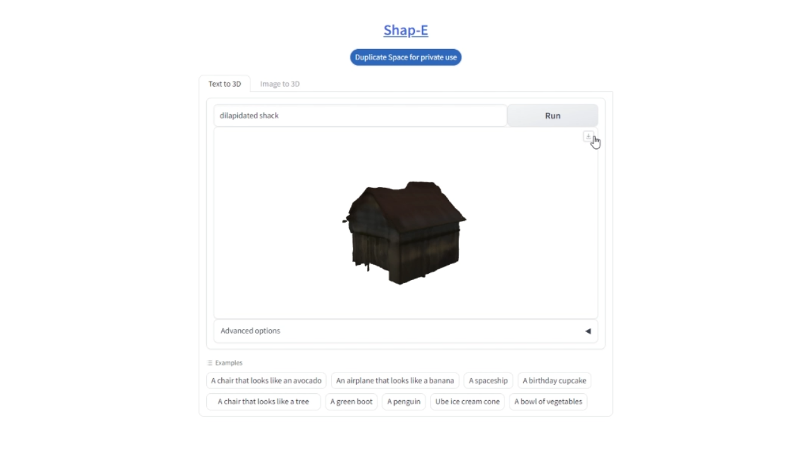

# AI 生成 3D 游戏资产

[原文地址：https://huggingface.co/blog/zh/3d-assets](https://huggingface.co/blog/zh/3d-assets)

## 简介

这是一篇来自 Hugging Face 的实操教程，演示如何将 AI 生成的文字描述，通过一条完整的工具链，最终变成可以放进游戏引擎的 3D 模型。

文章的聪明之处在于：没有硬拼 AI 的写实渲染（当前技术还不擅长），而是选择了 **PS1 复古风格**——低多边形、顶点着色、故障感画面——这套审美天然容错，非常适合用当下文字转 3D 的模型来生产素材。

## 工具链

| 步骤 | 工具 | 作用 |
|------|------|------|
| 1 | **Shap-E**（OpenAI）| 文字 → 3D 初始形状 |
| 2 | **Blender** + Decimate 修改器 | 降低多边形数量，优化游戏性能 |
| 3 | **Dream Textures**（Blender 插件）| AI 在 Blender 内直接生成无缝贴图 |
| 4 | Blender Smart UV Project | 自动 UV 展开 |
| 5 | **Unity** + 自定义着色器 | 导入模型并应用 PS1 风格渲染 |

## 核心步骤

**第一步：生成形状**  
在 Hugging Face Space 上用 Shap-E 输入文字提示（如 `Dilapidated Shack`），下载生成的 `.obj` 文件。

**第二步：压缩多边形**  
导入 Blender，用 Decimate 修改器将比例压低到约 `0.02`，去掉几何冗余，让模型在游戏引擎里跑得动。

**第三步：AI 贴图**  
安装 Dream Textures 插件（底层跑 Stable Diffusion 的 `texture-diffusion` 模型），将 Seamless 选项设为 `both`，生成可无限平铺的纹理贴图。

**第四步：UV 展开 + 导出**  
Smart UV Project 一键展开，FBX 格式导出，通用兼容 Unity / Unreal 等主流引擎。

**第五步：Unity 风格化**  
导入后使用顶点光照、无阴影、雾效、故障感后处理，复现 PS1 画风。

## 适合人群

- 独立游戏开发者，没有专业 3D 建模背景
- 想快速生成大量低保真素材的开发者
- 对 AI 辅助美术资产感兴趣的工程师

## 关键洞察

> 文字转 3D 的质量目前仍不及文字转图片，但选对风格（低保真/像素/复古），就能把局限变成特色。

这套流程本质上是一条"**无限低保真世界**"的生产线——只要会写提示词，就能批量生成风格统一的游戏素材。
